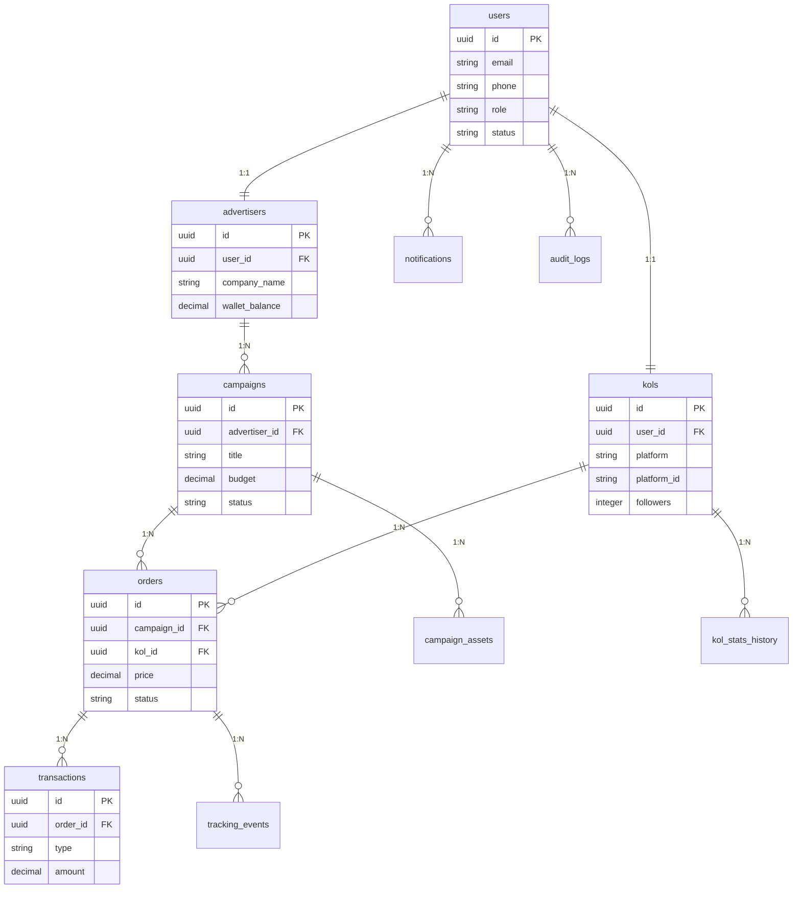

# AIAds 数据库表结构设计

**版本**: 1.0  
**创建日期**: 2026 年 3 月 24 日  
**作者**: AIAds 架构团队  
**保密级别**: 内部机密

---

## 1. 数据库设计概述

### 1.1 设计原则

```
1. 规范化：遵循第三范式 (3NF)，减少数据冗余
2. 可扩展：支持业务增长，便于添加新字段/表
3. 性能优先：合理索引，避免 N+1 查询
4. 安全合规：敏感数据加密，行级权限控制
5. 可维护：统一命名规范，完整注释
```

### 1.2 命名规范

| 对象 | 命名规则 | 示例 |
|-----|---------|------|
| **表名** | 小写 + 下划线，复数形式 | `users`, `campaigns` |
| **字段名** | 小写 + 下划线 | `created_at`, `user_id` |
| **主键** | `id` (UUID) | `id UUID PRIMARY KEY` |
| **外键** | `{引用表}_id` | `user_id`, `campaign_id` |
| **索引** | `idx_{表}_{字段}` | `idx_users_email` |
| **唯一约束** | `uk_{表}_{字段}` | `uk_users_email` |

### 1.3 数据类型选择

| 业务场景 | PostgreSQL 类型 | 说明 |
|---------|---------------|------|
| **主键** | `UUID` | 全局唯一，分布式友好 |
| **金额** | `DECIMAL(12,2)` | 精确计算，避免浮点误差 |
| **状态** | `ENUM` 或 `SMALLINT` | 有限状态集 |
| **文本** | `VARCHAR(n)` / `TEXT` | 根据长度选择 |
| **时间** | `TIMESTAMPTZ` | 带时区，统一 UTC |
| **布尔** | `BOOLEAN` | true/false |
| **JSON** | `JSONB` | 结构化数据，可查询 |

### 1.4 数据库 ER 图



---

## 2. 核心表结构

### 2.1 users (用户表)

**说明**: 存储所有用户的基础信息，包括广告主、KOL、管理员

```sql
-- 创建用户角色枚举类型
CREATE TYPE user_role AS ENUM ('advertiser', 'kol', 'admin', 'super_admin');

-- 创建用户状态枚举类型
CREATE TYPE user_status AS ENUM ('pending', 'active', 'suspended', 'deleted');

-- 创建用户表
CREATE TABLE users (
    -- 主键
    id UUID PRIMARY KEY DEFAULT gen_random_uuid(),
    
    -- 基本信息
    email VARCHAR(255) NOT NULL,
    phone VARCHAR(20),
    password_hash VARCHAR(255) NOT NULL,
    
    -- 个人资料
    avatar_url VARCHAR(512),
    nickname VARCHAR(100),
    real_name VARCHAR(100),
    
    -- 账户信息
    role user_role NOT NULL DEFAULT 'advertiser',
    status user_status NOT NULL DEFAULT 'pending',
    
    -- 认证信息
    email_verified BOOLEAN DEFAULT FALSE,
    email_verified_at TIMESTAMPTZ,
    phone_verified BOOLEAN DEFAULT FALSE,
    phone_verified_at TIMESTAMPTZ,
    
    -- 安全信息
    last_login_at TIMESTAMPTZ,
    last_login_ip INET,
    failed_login_attempts INTEGER DEFAULT 0,
    locked_until TIMESTAMPTZ,
    
    -- 偏好设置
    language VARCHAR(10) DEFAULT 'zh-CN',
    timezone VARCHAR(50) DEFAULT 'Asia/Shanghai',
    currency VARCHAR(3) DEFAULT 'CNY',
    
    -- 元数据
    metadata JSONB DEFAULT '{}'::jsonb,
    
    -- 时间戳
    created_at TIMESTAMPTZ DEFAULT CURRENT_TIMESTAMP,
    updated_at TIMESTAMPTZ DEFAULT CURRENT_TIMESTAMP,
    deleted_at TIMESTAMPTZ
);

-- 创建索引
CREATE UNIQUE INDEX idx_users_email ON users (email) WHERE deleted_at IS NULL;
CREATE UNIQUE INDEX idx_users_phone ON users (phone) WHERE phone IS NOT NULL AND deleted_at IS NULL;
CREATE INDEX idx_users_role ON users (role);
CREATE INDEX idx_users_status ON users (status);
CREATE INDEX idx_users_created_at ON users (created_at);

-- 创建更新时间触发器
CREATE OR REPLACE FUNCTION update_updated_at_column()
RETURNS TRIGGER AS $$
BEGIN
    NEW.updated_at = CURRENT_TIMESTAMP;
    RETURN NEW;
END;
$$ language 'plpgsql';

CREATE TRIGGER update_users_updated_at
    BEFORE UPDATE ON users
    FOR EACH ROW
    EXECUTE FUNCTION update_updated_at_column();

-- 添加注释
COMMENT ON TABLE users IS '用户表 - 存储所有用户的基础信息';
COMMENT ON COLUMN users.id IS '用户 ID (UUID)';
COMMENT ON COLUMN users.email IS '邮箱 (唯一)';
COMMENT ON COLUMN users.phone IS '手机号 (唯一)';
COMMENT ON COLUMN users.password_hash IS '密码哈希 (bcrypt)';
COMMENT ON COLUMN users.role IS '用户角色：advertiser-广告主，kol-博主，admin-管理员';
COMMENT ON COLUMN users.status IS '用户状态：pending-待激活，active-正常，suspended-冻结，deleted-已删除';
```

---

### 2.2 advertisers (广告主表)

**说明**: 存储广告主的企业信息和钱包余额

```sql
-- 创建认证状态枚举类型
CREATE TYPE verification_status AS ENUM ('pending', 'submitted', 'approved', 'rejected');

-- 创建广告主表
CREATE TABLE advertisers (
    -- 主键
    id UUID PRIMARY KEY DEFAULT gen_random_uuid(),
    
    -- 关联用户
    user_id UUID NOT NULL UNIQUE REFERENCES users(id) ON DELETE CASCADE,
    
    -- 企业信息
    company_name VARCHAR(255) NOT NULL,
    company_name_en VARCHAR(255),
    business_license VARCHAR(100),
    business_license_url VARCHAR(512),
    legal_representative VARCHAR(100),
    
    -- 联系信息
    contact_person VARCHAR(100),
    contact_phone VARCHAR(20),
    contact_email VARCHAR(255),
    contact_address TEXT,
    
    -- 行业信息
    industry VARCHAR(100),
    company_size VARCHAR(50),
    website VARCHAR(255),
    
    -- 认证信息
    verification_status verification_status NOT NULL DEFAULT 'pending',
    verified_at TIMESTAMPTZ,
    verified_by UUID REFERENCES users(id),
    rejection_reason TEXT,
    
    -- 钱包信息
    wallet_balance DECIMAL(12,2) NOT NULL DEFAULT 0.00,
    frozen_balance DECIMAL(12,2) NOT NULL DEFAULT 0.00,
    total_recharged DECIMAL(12,2) NOT NULL DEFAULT 0.00,
    total_spent DECIMAL(12,2) NOT NULL DEFAULT 0.00,
    
    -- 订阅信息
    subscription_plan VARCHAR(50) DEFAULT 'free',
    subscription_expires_at TIMESTAMPTZ,
    
    -- 统计信息
    total_campaigns INTEGER DEFAULT 0,
    active_campaigns INTEGER DEFAULT 0,
    total_orders INTEGER DEFAULT 0,
    
    -- 元数据
    metadata JSONB DEFAULT '{}'::jsonb,
    
    -- 时间戳
    created_at TIMESTAMPTZ DEFAULT CURRENT_TIMESTAMP,
    updated_at TIMESTAMPTZ DEFAULT CURRENT_TIMESTAMP
);

-- 创建索引
CREATE UNIQUE INDEX idx_advertisers_user_id ON advertisers (user_id);
CREATE UNIQUE INDEX idx_advertisers_business_license ON advertisers (business_license) WHERE business_license IS NOT NULL;
CREATE INDEX idx_advertisers_verification_status ON advertisers (verification_status);
CREATE INDEX idx_advertisers_industry ON advertisers (industry);

-- 创建更新时间触发器
CREATE TRIGGER update_advertisers_updated_at
    BEFORE UPDATE ON advertisers
    FOR EACH ROW
    EXECUTE FUNCTION update_updated_at_column();

-- 添加注释
COMMENT ON TABLE advertisers IS '广告主表 - 存储广告主的企业信息和钱包';
COMMENT ON COLUMN advertisers.user_id IS '关联的用户 ID';
COMMENT ON COLUMN advertisers.verification_status IS '认证状态：pending-待提交，submitted-已提交，approved-已通过，rejected-已拒绝';
COMMENT ON COLUMN advertisers.wallet_balance IS '可用余额';
COMMENT ON COLUMN advertisers.frozen_balance IS '冻结金额 (进行中订单)';
```

---

### 2.3 kols (KOL 表)

**说明**: 存储 KOL 的社交媒体账号信息和统计数据

```sql
-- 创建支持的平台枚举类型
CREATE TYPE kol_platform AS ENUM ('tiktok', 'youtube', 'instagram', 'xiaohongshu', 'weibo');

-- 创建 KOL 状态枚举类型
CREATE TYPE kol_status AS ENUM ('pending', 'active', 'verified', 'suspended', 'banned');

-- 创建 KOL 表
CREATE TABLE kols (
    -- 主键
    id UUID PRIMARY KEY DEFAULT gen_random_uuid(),
    
    -- 关联用户
    user_id UUID NOT NULL UNIQUE REFERENCES users(id) ON DELETE CASCADE,
    
    -- 平台信息
    platform kol_platform NOT NULL,
    platform_id VARCHAR(255) NOT NULL,  -- 平台用户 ID
    platform_username VARCHAR(255) NOT NULL,  -- 平台用户名
    platform_display_name VARCHAR(255),  -- 平台显示名称
    platform_avatar_url VARCHAR(512),
    
    -- 账号信息
    bio TEXT,
    category VARCHAR(100),  -- 内容分类：美妆、时尚、科技等
    subcategory VARCHAR(100),
    
    -- 地区信息
    country VARCHAR(50),
    region VARCHAR(100),
    city VARCHAR(100),
    
    -- 粉丝数据
    followers INTEGER NOT NULL DEFAULT 0,
    following INTEGER DEFAULT 0,
    total_videos INTEGER DEFAULT 0,
    total_likes INTEGER DEFAULT 0,
    
    -- 互动数据
    avg_views INTEGER DEFAULT 0,
    avg_likes INTEGER DEFAULT 0,
    avg_comments INTEGER DEFAULT 0,
    avg_shares INTEGER DEFAULT 0,
    engagement_rate DECIMAL(5,4) DEFAULT 0.0000,  -- 互动率 (0-1)
    
    -- 认证信息
    status kol_status NOT NULL DEFAULT 'pending',
    verified BOOLEAN DEFAULT FALSE,
    verified_at TIMESTAMPTZ,
    verified_by UUID REFERENCES users(id),
    
    -- 价格信息
    base_price DECIMAL(10,2),  -- 基础报价
    price_per_video DECIMAL(10,2),  -- 单视频价格
    currency VARCHAR(3) DEFAULT 'USD',
    
    -- 账户信息
    total_earnings DECIMAL(12,2) NOT NULL DEFAULT 0.00,
    available_balance DECIMAL(12,2) NOT NULL DEFAULT 0.00,
    pending_balance DECIMAL(12,2) NOT NULL DEFAULT 0.00,
    
    -- 统计信息
    total_orders INTEGER DEFAULT 0,
    completed_orders INTEGER DEFAULT 0,
    avg_rating DECIMAL(3,2) DEFAULT 0.00,
    
    -- 标签
    tags TEXT[] DEFAULT '{}',
    
    -- 元数据
    metadata JSONB DEFAULT '{}'::jsonb,
    
    -- 时间戳
    created_at TIMESTAMPTZ DEFAULT CURRENT_TIMESTAMP,
    updated_at TIMESTAMPTZ DEFAULT CURRENT_TIMESTAMP,
    last_synced_at TIMESTAMPTZ
);

-- 创建索引
CREATE UNIQUE INDEX idx_kols_user_id ON kols (user_id);
CREATE UNIQUE INDEX idx_kols_platform_account ON kols (platform, platform_id);
CREATE INDEX idx_kols_platform ON kols (platform);
CREATE INDEX idx_kols_status ON kols (status);
CREATE INDEX idx_kols_category ON kols (category);
CREATE INDEX idx_kols_country ON kols (country);
CREATE INDEX idx_kols_followers ON kols (followers);
CREATE INDEX idx_kols_engagement_rate ON kols (engagement_rate);
CREATE INDEX idx_kols_tags ON kols USING GIN (tags);

-- 创建更新时间触发器
CREATE TRIGGER update_kols_updated_at
    BEFORE UPDATE ON kols
    FOR EACH ROW
    EXECUTE FUNCTION update_updated_at_column();

-- 添加注释
COMMENT ON TABLE kols IS 'KOL 表 - 存储博主的社交媒体账号和统计数据';
COMMENT ON COLUMN kols.platform IS '社交平台：tiktok, youtube, instagram, xiaohongshu, weibo';
COMMENT ON COLUMN kols.platform_id IS '平台用户 ID';
COMMENT ON COLUMN kols.engagement_rate IS '互动率 = (点赞 + 评论 + 分享) / 粉丝数';
COMMENT ON COLUMN kols.status IS 'KOL 状态：pending-待审核，active-活跃，verified-已认证，suspended-暂停，banned-封禁';
```

---

### 2.4 kol_stats_history (KOL 数据统计历史表)

**说明**: 记录 KOL 统计数据的历史变化，用于趋势分析

```sql
CREATE TABLE kol_stats_history (
    -- 主键
    id UUID PRIMARY KEY DEFAULT gen_random_uuid(),
    
    -- 关联 KOL
    kol_id UUID NOT NULL REFERENCES kols(id) ON DELETE CASCADE,
    
    -- 统计数据
    followers INTEGER NOT NULL,
    following INTEGER,
    total_videos INTEGER,
    total_likes INTEGER,
    avg_views INTEGER,
    avg_likes INTEGER,
    avg_comments INTEGER,
    avg_shares INTEGER,
    engagement_rate DECIMAL(5,4),
    
    -- 快照时间
    snapshot_date DATE NOT NULL,
    
    -- 时间戳
    created_at TIMESTAMPTZ DEFAULT CURRENT_TIMESTAMP
);

-- 创建索引
CREATE INDEX idx_kol_stats_history_kol_id ON kol_stats_history (kol_id);
CREATE INDEX idx_kol_stats_history_snapshot_date ON kol_stats_history (snapshot_date);
CREATE UNIQUE INDEX idx_kol_stats_history_kol_date ON kol_stats_history (kol_id, snapshot_date);

-- 添加注释
COMMENT ON TABLE kol_stats_history IS 'KOL 数据统计历史表 - 记录 KOL 数据变化趋势';
```

---

### 2.5 campaigns (投放活动表)

**说明**: 存储广告主创建的投放活动/需求

```sql
-- 创建活动状态枚举类型
CREATE TYPE campaign_status AS ENUM (
    'draft',           -- 草稿
    'pending_review',  -- 待审核
    'active',          -- 进行中
    'paused',          -- 已暂停
    'completed',       -- 已完成
    'cancelled',       -- 已取消
    'rejected'         -- 已拒绝
);

-- 创建活动目标枚举类型
CREATE TYPE campaign_objective AS ENUM (
    'awareness',       -- 品牌曝光
    'engagement',      -- 互动
    'traffic',         -- 引流
    'conversion',      -- 转化
    'sales'            -- 销售
);

-- 创建投放活动表
CREATE TABLE campaigns (
    -- 主键
    id UUID PRIMARY KEY DEFAULT gen_random_uuid(),
    
    -- 关联广告主
    advertiser_id UUID NOT NULL REFERENCES advertisers(id) ON DELETE CASCADE,
    
    -- 基本信息
    title VARCHAR(255) NOT NULL,
    description TEXT,
    objective campaign_objective NOT NULL DEFAULT 'awareness',
    
    -- 预算信息
    budget DECIMAL(12,2) NOT NULL,
    budget_type VARCHAR(50) DEFAULT 'fixed',  -- fixed-固定，per_video-按视频
    spent_amount DECIMAL(12,2) NOT NULL DEFAULT 0.00,
    
    -- 目标受众
    target_audience JSONB,  -- {age_range, gender, locations, interests}
    target_platforms kol_platform[],
    
    -- KOL 要求
    min_followers INTEGER DEFAULT 1000,
    max_followers INTEGER DEFAULT 50000,
    min_engagement_rate DECIMAL(5,4),
    required_categories TEXT[],
    excluded_categories TEXT[],
    target_countries TEXT[],
    
    -- 内容要求
    content_requirements TEXT,
    content_guidelines TEXT,
    required_hashtags TEXT[],
    required_mentions TEXT[],
    
    -- 时间安排
    start_date DATE,
    end_date DATE,
    deadline TIMESTAMPTZ,
    
    -- 状态
    status campaign_status NOT NULL DEFAULT 'draft',
    
    -- 统计信息
    total_kols INTEGER DEFAULT 0,
    applied_kols INTEGER DEFAULT 0,
    selected_kols INTEGER DEFAULT 0,
    published_videos INTEGER DEFAULT 0,
    total_views INTEGER DEFAULT 0,
    total_likes INTEGER DEFAULT 0,
    total_comments INTEGER DEFAULT 0,
    
    -- 审核信息
    reviewed_by UUID REFERENCES users(id),
    reviewed_at TIMESTAMPTZ,
    review_notes TEXT,
    
    -- 元数据
    metadata JSONB DEFAULT '{}'::jsonb,
    
    -- 时间戳
    created_at TIMESTAMPTZ DEFAULT CURRENT_TIMESTAMP,
    updated_at TIMESTAMPTZ DEFAULT CURRENT_TIMESTAMP
);

-- 创建索引
CREATE INDEX idx_campaigns_advertiser_id ON campaigns (advertiser_id);
CREATE INDEX idx_campaigns_status ON campaigns (status);
CREATE INDEX idx_campaigns_objective ON campaigns (objective);
CREATE INDEX idx_campaigns_start_date ON campaigns (start_date);
CREATE INDEX idx_campaigns_end_date ON campaigns (end_date);
CREATE INDEX idx_campaigns_target_platforms ON campaigns USING GIN (target_platforms);
CREATE INDEX idx_campaigns_target_countries ON campaigns USING GIN (target_countries);

-- 创建更新时间触发器
CREATE TRIGGER update_campaigns_updated_at
    BEFORE UPDATE ON campaigns
    FOR EACH ROW
    EXECUTE FUNCTION update_updated_at_column();

-- 添加注释
COMMENT ON TABLE campaigns IS '投放活动表 - 存储广告主创建的投放需求';
COMMENT ON COLUMN campaigns.target_audience IS '目标受众配置 (JSON): {age_range, gender, locations, interests}';
COMMENT ON COLUMN campaigns.status IS '活动状态：draft-草稿，active-进行中，completed-已完成，cancelled-已取消';
```

---

### 2.6 campaign_assets (活动素材表)

**说明**: 存储活动相关的素材文件

```sql
-- 创建素材类型枚举类型
CREATE TYPE asset_type AS ENUM (
    'brief',           -- 需求简报
    'image',           -- 图片
    'video',           -- 视频
    'document',        -- 文档
    'product_sample',  -- 产品样品
    'other'            -- 其他
);

CREATE TABLE campaign_assets (
    -- 主键
    id UUID PRIMARY KEY DEFAULT gen_random_uuid(),
    
    -- 关联活动
    campaign_id UUID NOT NULL REFERENCES campaigns(id) ON DELETE CASCADE,
    
    -- 素材信息
    type asset_type NOT NULL,
    name VARCHAR(255) NOT NULL,
    description TEXT,
    
    -- 文件信息
    file_url VARCHAR(512) NOT NULL,
    file_type VARCHAR(50),
    file_size INTEGER,
    
    -- 元数据
    metadata JSONB DEFAULT '{}'::jsonb,
    
    -- 时间戳
    created_at TIMESTAMPTZ DEFAULT CURRENT_TIMESTAMP,
    created_by UUID REFERENCES users(id)
);

-- 创建索引
CREATE INDEX idx_campaign_assets_campaign_id ON campaign_assets (campaign_id);
CREATE INDEX idx_campaign_assets_type ON campaign_assets (type);

-- 添加注释
COMMENT ON TABLE campaign_assets IS '活动素材表 - 存储活动相关的素材文件';
```

---

### 2.7 orders (订单表)

**说明**: 存储 KOL 合作订单

```sql
-- 创建订单状态枚举类型
CREATE TYPE order_status AS ENUM (
    'pending',         -- 待确认
    'accepted',        -- 已接受
    'rejected',        -- 已拒绝
    'in_progress',     -- 进行中
    'submitted',       -- 已提交 (待审核)
    'approved',        -- 已批准
    'revision',        -- 需要修改
    'published',       -- 已发布
    'completed',       -- 已完成
    'cancelled',       -- 已取消
    'disputed'         -- 有争议
);

-- 创建订单表
CREATE TABLE orders (
    -- 主键
    id UUID PRIMARY KEY DEFAULT gen_random_uuid(),
    
    -- 关联信息
    campaign_id UUID NOT NULL REFERENCES campaigns(id) ON DELETE CASCADE,
    kol_id UUID NOT NULL REFERENCES kols(id) ON DELETE CASCADE,
    advertiser_id UUID NOT NULL REFERENCES advertisers(id) ON DELETE CASCADE,
    
    -- 订单编号
    order_no VARCHAR(50) NOT NULL UNIQUE,  -- 格式：ORD-YYYYMMDD-XXXXX
    
    -- 价格信息
    price DECIMAL(10,2) NOT NULL,
    platform_fee DECIMAL(10,2) NOT NULL,  -- 平台佣金
    kol_earning DECIMAL(10,2) NOT NULL,   -- KOL 收益
    
    -- 内容信息
    content_type VARCHAR(50) DEFAULT 'video',  -- video, image, post
    content_count INTEGER DEFAULT 1,
    content_description TEXT,
    
    -- 内容 URL
    draft_urls TEXT[],
    published_urls TEXT[],
    
    -- 时间安排
    accepted_at TIMESTAMPTZ,
    deadline TIMESTAMPTZ,
    submitted_at TIMESTAMPTZ,
    approved_at TIMESTAMPTZ,
    published_at TIMESTAMPTZ,
    completed_at TIMESTAMPTZ,
    
    -- 状态
    status order_status NOT NULL DEFAULT 'pending',
    
    -- 审核信息
    review_notes TEXT,
    revision_count INTEGER DEFAULT 0,
    
    -- 评价信息
    advertiser_rating INTEGER,  -- 广告主评分 (1-5)
    advertiser_review TEXT,
    kol_rating INTEGER,         -- KOL 评分 (1-5)
    kol_review TEXT,
    
    -- 数据追踪
    views INTEGER DEFAULT 0,
    likes INTEGER DEFAULT 0,
    comments INTEGER DEFAULT 0,
    shares INTEGER DEFAULT 0,
    
    -- 元数据
    metadata JSONB DEFAULT '{}'::jsonb,
    
    -- 时间戳
    created_at TIMESTAMPTZ DEFAULT CURRENT_TIMESTAMP,
    updated_at TIMESTAMPTZ DEFAULT CURRENT_TIMESTAMP
);

-- 创建索引
CREATE INDEX idx_orders_campaign_id ON orders (campaign_id);
CREATE INDEX idx_orders_kol_id ON orders (kol_id);
CREATE INDEX idx_orders_advertiser_id ON orders (advertiser_id);
CREATE INDEX idx_orders_status ON orders (status);
CREATE INDEX idx_orders_order_no ON orders (order_no);
CREATE INDEX idx_orders_created_at ON orders (created_at);
CREATE INDEX idx_orders_published_at ON orders (published_at) WHERE published_at IS NOT NULL;

-- 创建更新时间触发器
CREATE TRIGGER update_orders_updated_at
    BEFORE UPDATE ON orders
    FOR EACH ROW
    EXECUTE FUNCTION update_updated_at_column();

-- 添加注释
COMMENT ON TABLE orders IS '订单表 - 存储 KOL 合作订单';
COMMENT ON COLUMN orders.order_no IS '订单编号 (业务唯一)';
COMMENT ON COLUMN orders.platform_fee IS '平台佣金 (价格 * 佣金比例)';
COMMENT ON COLUMN orders.kol_earning IS 'KOL 实际收益 (价格 - 平台佣金)';
COMMENT ON COLUMN orders.status IS '订单状态：pending-待确认，in_progress-进行中，published-已发布，completed-已完成';
```

---

### 2.8 transactions (交易表)

**说明**: 存储所有资金交易记录

```sql
-- 创建交易类型枚举类型
CREATE TYPE transaction_type AS ENUM (
    'recharge',        -- 充值
    'order_payment',   -- 订单支付
    'order_income',    -- 订单收入
    'withdrawal',      -- 提现
    'refund',          -- 退款
    'platform_fee',    -- 平台佣金
    'adjustment',      -- 调整
    'bonus'            -- 奖励
);

-- 创建交易状态枚举类型
CREATE TYPE transaction_status AS ENUM (
    'pending',         -- 待处理
    'processing',      -- 处理中
    'completed',       -- 已完成
    'failed',          -- 失败
    'cancelled'        -- 已取消
);

-- 创建支付方式枚举类型
CREATE TYPE payment_method AS ENUM (
    'alipay',          -- 支付宝
    'wechat_pay',      -- 微信支付
    'stripe',          -- Stripe (信用卡)
    'paypal',          -- PayPal
    'bank_transfer',   -- 银行转账
    'wallet'           -- 钱包余额
);

-- 创建交易表
CREATE TABLE transactions (
    -- 主键
    id UUID PRIMARY KEY DEFAULT gen_random_uuid(),
    
    -- 关联信息
    order_id UUID REFERENCES orders(id) ON DELETE SET NULL,
    advertiser_id UUID REFERENCES advertisers(id) ON DELETE SET NULL,
    kol_id UUID REFERENCES kols(id) ON DELETE SET NULL,
    
    -- 交易编号
    transaction_no VARCHAR(50) NOT NULL UNIQUE,  -- 格式：TXN-YYYYMMDD-XXXXX
    
    -- 交易信息
    type transaction_type NOT NULL,
    amount DECIMAL(12,2) NOT NULL,
    currency VARCHAR(3) NOT NULL DEFAULT 'CNY',
    
    -- 支付信息
    payment_method payment_method,
    payment_ref VARCHAR(255),  -- 第三方支付参考号
    
    -- 状态
    status transaction_status NOT NULL DEFAULT 'pending',
    
    -- 余额变动
    balance_before DECIMAL(12,2),
    balance_after DECIMAL(12,2),
    
    -- 描述
    description TEXT,
    
    -- 元数据
    metadata JSONB DEFAULT '{}'::jsonb,
    
    -- 时间戳
    created_at TIMESTAMPTZ DEFAULT CURRENT_TIMESTAMP,
    completed_at TIMESTAMPTZ,
    failed_at TIMESTAMPTZ,
    failure_reason TEXT
);

-- 创建索引
CREATE INDEX idx_transactions_order_id ON transactions (order_id);
CREATE INDEX idx_transactions_advertiser_id ON transactions (advertiser_id);
CREATE INDEX idx_transactions_kol_id ON transactions (kol_id);
CREATE INDEX idx_transactions_type ON transactions (type);
CREATE INDEX idx_transactions_status ON transactions (status);
CREATE INDEX idx_transactions_transaction_no ON transactions (transaction_no);
CREATE INDEX idx_transactions_created_at ON transactions (created_at);

-- 添加注释
COMMENT ON TABLE transactions IS '交易表 - 存储所有资金交易记录';
COMMENT ON COLUMN transactions.type IS '交易类型：recharge-充值，order_payment-订单支付，withdrawal-提现';
COMMENT ON COLUMN transactions.payment_method IS '支付方式：alipay, wechat_pay, stripe, paypal, bank_transfer, wallet';
```

---

### 2.9 tracking_events (数据追踪表)

**说明**: 存储订单的效果追踪数据

```sql
-- 创建事件类型枚举类型
CREATE TYPE tracking_event_type AS ENUM (
    'impression',      -- 曝光
    'click',           -- 点击
    'like',            -- 点赞
    'comment',         -- 评论
    'share',           -- 分享
    'follow',          -- 关注
    'conversion',      -- 转化
    'sale'             -- 销售
);

-- 创建数据追踪表
CREATE TABLE tracking_events (
    -- 主键
    id UUID PRIMARY KEY DEFAULT gen_random_uuid(),
    
    -- 关联订单
    order_id UUID NOT NULL REFERENCES orders(id) ON DELETE CASCADE,
    
    -- 事件信息
    event_type tracking_event_type NOT NULL,
    event_data JSONB,  -- {source, device, location, etc.}
    
    -- 事件值
    event_value INTEGER DEFAULT 1,
    event_revenue DECIMAL(12,2),
    
    -- 来源信息
    source_url VARCHAR(512),
    source_platform VARCHAR(50),
    
    -- 用户信息 (可选，用于转化追踪)
    user_id VARCHAR(255),  -- 匿名用户 ID
    session_id VARCHAR(255),
    
    -- 设备信息
    device_type VARCHAR(50),
    os VARCHAR(50),
    browser VARCHAR(50),
    
    -- 地区信息
    country VARCHAR(50),
    region VARCHAR(100),
    city VARCHAR(100),
    
    -- 时间戳
    event_time TIMESTAMPTZ NOT NULL DEFAULT CURRENT_TIMESTAMP,
    created_at TIMESTAMPTZ DEFAULT CURRENT_TIMESTAMP
);

-- 创建索引
CREATE INDEX idx_tracking_events_order_id ON tracking_events (order_id);
CREATE INDEX idx_tracking_events_event_type ON tracking_events (event_type);
CREATE INDEX idx_tracking_events_event_time ON tracking_events (event_time);
CREATE INDEX idx_tracking_events_source_platform ON tracking_events (source_platform);
CREATE INDEX idx_tracking_events_country ON tracking_events (country);

-- 添加注释
COMMENT ON TABLE tracking_events IS '数据追踪表 - 存储订单的效果追踪数据';
COMMENT ON COLUMN tracking_events.event_data IS '事件详细数据 (JSON)';
```

---

### 2.10 notifications (通知表)

**说明**: 存储用户通知

```sql
-- 创建通知类型枚举类型
CREATE TYPE notification_type AS ENUM (
    'system',          -- 系统通知
    'order',           -- 订单通知
    'payment',         -- 支付通知
    'campaign',        -- 活动通知
    'message',         -- 消息通知
    'reminder'         -- 提醒
);

-- 创建通知表
CREATE TABLE notifications (
    -- 主键
    id UUID PRIMARY KEY DEFAULT gen_random_uuid(),
    
    -- 关联用户
    user_id UUID NOT NULL REFERENCES users(id) ON DELETE CASCADE,
    
    -- 通知信息
    type notification_type NOT NULL,
    title VARCHAR(255) NOT NULL,
    content TEXT NOT NULL,
    
    -- 关联数据
    related_type VARCHAR(50),  -- order, campaign, etc.
    related_id UUID,
    
    -- 状态
    is_read BOOLEAN DEFAULT FALSE,
    read_at TIMESTAMPTZ,
    
    -- 操作
    action_url VARCHAR(512),
    action_text VARCHAR(100),
    
    -- 时间戳
    created_at TIMESTAMPTZ DEFAULT CURRENT_TIMESTAMP
);

-- 创建索引
CREATE INDEX idx_notifications_user_id ON notifications (user_id);
CREATE INDEX idx_notifications_type ON notifications (type);
CREATE INDEX idx_notifications_is_read ON notifications (is_read) WHERE is_read = FALSE;
CREATE INDEX idx_notifications_created_at ON notifications (created_at);

-- 添加注释
COMMENT ON TABLE notifications IS '通知表 - 存储用户通知';
```

---

### 2.11 audit_logs (审计日志表)

**说明**: 记录重要操作的审计日志

```sql
-- 创建操作类型枚举类型
CREATE TYPE audit_action AS ENUM (
    'create',
    'update',
    'delete',
    'login',
    'logout',
    'export',
    'import',
    'approve',
    'reject'
);

-- 创建审计日志表
CREATE TABLE audit_logs (
    -- 主键
    id UUID PRIMARY KEY DEFAULT gen_random_uuid(),
    
    -- 操作信息
    action audit_action NOT NULL,
    resource_type VARCHAR(100) NOT NULL,
    resource_id UUID,
    
    -- 操作者
    user_id UUID REFERENCES users(id),
    user_email VARCHAR(255),
    user_ip INET,
    user_agent TEXT,
    
    -- 变更内容
    old_values JSONB,
    new_values JSONB,
    changes JSONB,  -- 差异对比
    
    -- 描述
    description TEXT,
    
    -- 时间戳
    created_at TIMESTAMPTZ DEFAULT CURRENT_TIMESTAMP
);

-- 创建索引
CREATE INDEX idx_audit_logs_user_id ON audit_logs (user_id);
CREATE INDEX idx_audit_logs_action ON audit_logs (action);
CREATE INDEX idx_audit_logs_resource ON audit_logs (resource_type, resource_id);
CREATE INDEX idx_audit_logs_created_at ON audit_logs (created_at);

-- 添加注释
COMMENT ON TABLE audit_logs IS '审计日志表 - 记录重要操作的审计日志';
```

---

### 2.12 withdrawal_requests (提现申请表)

**说明**: 存储 KOL 的提现申请

```sql
-- 创建提现状态枚举类型
CREATE TYPE withdrawal_status AS ENUM (
    'pending',         -- 待审核
    'approved',        -- 已批准
    'processing',      -- 处理中
    'completed',       -- 已完成
    'rejected',        -- 已拒绝
    'failed'           -- 失败
);

-- 创建提现方式枚举类型
CREATE TYPE withdrawal_method AS ENUM (
    'paypal',
    'stripe',
    'bank_transfer',
    'alipay'
);

-- 创建提现申请表
CREATE TABLE withdrawal_requests (
    -- 主键
    id UUID PRIMARY KEY DEFAULT gen_random_uuid(),
    
    -- 关联 KOL
    kol_id UUID NOT NULL REFERENCES kols(id) ON DELETE CASCADE,
    user_id UUID NOT NULL REFERENCES users(id) ON DELETE CASCADE,
    
    -- 提现编号
    withdrawal_no VARCHAR(50) NOT NULL UNIQUE,
    
    -- 金额信息
    amount DECIMAL(12,2) NOT NULL,
    fee DECIMAL(12,2) DEFAULT 0.00,
    net_amount DECIMAL(12,2) NOT NULL,
    currency VARCHAR(3) NOT NULL DEFAULT 'USD',
    
    -- 提现方式
    method withdrawal_method NOT NULL,
    
    -- 收款信息
    recipient_name VARCHAR(255) NOT NULL,
    recipient_account VARCHAR(255) NOT NULL,
    recipient_bank VARCHAR(255),
    recipient_country VARCHAR(50),
    
    -- 状态
    status withdrawal_status NOT NULL DEFAULT 'pending',
    
    -- 审核信息
    reviewed_by UUID REFERENCES users(id),
    reviewed_at TIMESTAMPTZ,
    review_notes TEXT,
    
    -- 支付信息
    payment_ref VARCHAR(255),
    paid_at TIMESTAMPTZ,
    
    -- 时间戳
    created_at TIMESTAMPTZ DEFAULT CURRENT_TIMESTAMP,
    updated_at TIMESTAMPTZ DEFAULT CURRENT_TIMESTAMP
);

-- 创建索引
CREATE INDEX idx_withdrawal_requests_kol_id ON withdrawal_requests (kol_id);
CREATE INDEX idx_withdrawal_requests_user_id ON withdrawal_requests (user_id);
CREATE INDEX idx_withdrawal_requests_status ON withdrawal_requests (status);
CREATE INDEX idx_withdrawal_requests_withdrawal_no ON withdrawal_requests (withdrawal_no);
CREATE INDEX idx_withdrawal_requests_created_at ON withdrawal_requests (created_at);

-- 创建更新时间触发器
CREATE TRIGGER update_withdrawal_requests_updated_at
    BEFORE UPDATE ON withdrawal_requests
    FOR EACH ROW
    EXECUTE FUNCTION update_updated_at_column();

-- 添加注释
COMMENT ON TABLE withdrawal_requests IS '提现申请表 - 存储 KOL 的提现申请';
```

---

## 3. 视图和函数

### 3.1 KOL 公开信息视图

```sql
-- 创建 KOL 公开信息视图 (用于 KOL 列表展示)
CREATE VIEW kol_public_profiles AS
SELECT
    k.id,
    k.platform,
    k.platform_username,
    k.platform_display_name,
    k.platform_avatar_url,
    k.bio,
    k.category,
    k.subcategory,
    k.country,
    k.region,
    k.city,
    k.followers,
    k.avg_views,
    k.avg_likes,
    k.avg_comments,
    k.engagement_rate,
    k.base_price,
    k.price_per_video,
    k.currency,
    k.total_orders,
    k.completed_orders,
    k.avg_rating,
    k.tags,
    k.status,
    k.verified,
    u.avatar_url,
    u.nickname
FROM kols k
JOIN users u ON k.user_id = u.id
WHERE k.status IN ('active', 'verified')
  AND u.status = 'active';

-- 添加注释
COMMENT ON VIEW kol_public_profiles IS 'KOL 公开信息视图 - 用于 KOL 列表展示';
```

---

### 3.2 广告主统计视图

```sql
-- 创建广告主统计视图
CREATE VIEW advertiser_stats AS
SELECT
    a.id,
    a.user_id,
    a.company_name,
    a.wallet_balance,
    a.total_recharged,
    a.total_spent,
    COUNT(DISTINCT c.id) AS total_campaigns,
    COUNT(DISTINCT CASE WHEN c.status = 'active' THEN c.id END) AS active_campaigns,
    COUNT(DISTINCT o.id) AS total_orders,
    COUNT(DISTINCT CASE WHEN o.status = 'completed' THEN o.id END) AS completed_orders,
    SUM(CASE WHEN t.type = 'recharge' THEN t.amount ELSE 0 END) AS total_recharge_amount,
    SUM(CASE WHEN t.type = 'order_payment' THEN t.amount ELSE 0 END) AS total_payment_amount
FROM advertisers a
LEFT JOIN campaigns c ON a.id = c.advertiser_id
LEFT JOIN orders o ON a.id = o.advertiser_id
LEFT JOIN transactions t ON a.id = t.advertiser_id
GROUP BY a.id, a.user_id, a.company_name, a.wallet_balance, a.total_recharged, a.total_spent;

-- 添加注释
COMMENT ON VIEW advertiser_stats IS '广告主统计视图';
```

---

### 3.3 订单详情视图

```sql
-- 创建订单详情视图
CREATE VIEW order_details AS
SELECT
    o.id,
    o.order_no,
    o.status,
    o.price,
    o.platform_fee,
    o.kol_earning,
    o.content_type,
    o.published_urls,
    o.views,
    o.likes,
    o.comments,
    o.shares,
    o.created_at,
    o.published_at,
    o.completed_at,
    c.title AS campaign_title,
    c.objective AS campaign_objective,
    a.company_name AS advertiser_name,
    a.contact_person AS advertiser_contact,
    k.platform AS kol_platform,
    k.platform_username AS kol_username,
    k.followers AS kol_followers,
    k.engagement_rate AS kol_engagement_rate,
    u.email AS kol_email,
    u.phone AS kol_phone
FROM orders o
JOIN campaigns c ON o.campaign_id = c.id
JOIN advertisers a ON o.advertiser_id = a.id
JOIN kols k ON o.kol_id = k.id
JOIN users u ON k.user_id = u.id;

-- 添加注释
COMMENT ON VIEW order_details IS '订单详情视图 - 包含订单完整信息';
```

---

### 3.4 每日 KOL 数据同步函数

```sql
-- 创建函数：更新 KOL 统计数据
CREATE OR REPLACE FUNCTION update_kol_stats(
    p_kol_id UUID,
    p_followers INTEGER,
    p_following INTEGER,
    p_total_videos INTEGER,
    p_total_likes INTEGER,
    p_avg_views INTEGER,
    p_avg_likes INTEGER,
    p_avg_comments INTEGER,
    p_avg_shares INTEGER
)
RETURNS VOID AS $$
DECLARE
    v_engagement_rate DECIMAL(5,4);
BEGIN
    -- 计算互动率
    IF p_followers > 0 THEN
        v_engagement_rate := (p_avg_likes + p_avg_comments + p_avg_shares)::DECIMAL / p_followers;
    ELSE
        v_engagement_rate := 0;
    END IF;
    
    -- 更新 KOL 表
    UPDATE kols
    SET
        followers = p_followers,
        following = p_following,
        total_videos = p_total_videos,
        total_likes = p_total_likes,
        avg_views = p_avg_views,
        avg_likes = p_avg_likes,
        avg_comments = p_avg_comments,
        avg_shares = p_avg_shares,
        engagement_rate = v_engagement_rate,
        last_synced_at = CURRENT_TIMESTAMP,
        updated_at = CURRENT_TIMESTAMP
    WHERE id = p_kol_id;
    
    -- 插入历史记录
    INSERT INTO kol_stats_history (
        kol_id, followers, following, total_videos, total_likes,
        avg_views, avg_likes, avg_comments, avg_shares, engagement_rate,
        snapshot_date
    ) VALUES (
        p_kol_id, p_followers, p_following, p_total_videos, p_total_likes,
        p_avg_views, p_avg_likes, p_avg_comments, p_avg_shares, v_engagement_rate,
        CURRENT_DATE
    )
    ON CONFLICT (kol_id, snapshot_date) DO UPDATE
    SET
        followers = EXCLUDED.followers,
        following = EXCLUDED.following,
        total_videos = EXCLUDED.total_videos,
        total_likes = EXCLUDED.total_likes,
        avg_views = EXCLUDED.avg_views,
        avg_likes = EXCLUDED.avg_likes,
        avg_comments = EXCLUDED.avg_comments,
        avg_shares = EXCLUDED.avg_shares,
        engagement_rate = EXCLUDED.engagement_rate;
END;
$$ LANGUAGE plpgsql;

-- 添加注释
COMMENT ON FUNCTION update_kol_stats IS '更新 KOL 统计数据并记录历史';
```

---

### 3.5 创建订单编号函数

```sql
-- 创建函数：生成订单编号
CREATE OR REPLACE FUNCTION generate_order_no()
RETURNS VARCHAR(50) AS $$
DECLARE
    v_date_prefix VARCHAR(20);
    v_random_suffix VARCHAR(10);
    v_order_no VARCHAR(50);
BEGIN
    -- 日期前缀：ORD-YYYYMMDD
    v_date_prefix := 'ORD-' || TO_CHAR(CURRENT_DATE, 'YYYYMMDD') || '-';
    
    -- 生成随机后缀 (5 位数字)
    v_random_suffix := LPAD(FLOOR(RANDOM() * 100000)::TEXT, 5, '0');
    
    -- 组合订单编号
    v_order_no := v_date_prefix || v_random_suffix;
    
    -- 检查是否已存在，存在则递归生成
    WHILE EXISTS (SELECT 1 FROM orders WHERE order_no = v_order_no) LOOP
        v_random_suffix := LPAD(FLOOR(RANDOM() * 100000)::TEXT, 5, '0');
        v_order_no := v_date_prefix || v_random_suffix;
    END LOOP;
    
    RETURN v_order_no;
END;
$$ LANGUAGE plpgsql;

-- 添加注释
COMMENT ON FUNCTION generate_order_no IS '生成唯一订单编号';
```

---

### 3.6 创建交易编号函数

```sql
-- 创建函数：生成交易编号
CREATE OR REPLACE FUNCTION generate_transaction_no()
RETURNS VARCHAR(50) AS $$
DECLARE
    v_date_prefix VARCHAR(20);
    v_random_suffix VARCHAR(10);
    v_transaction_no VARCHAR(50);
BEGIN
    -- 日期前缀：TXN-YYYYMMDD
    v_date_prefix := 'TXN-' || TO_CHAR(CURRENT_DATE, 'YYYYMMDD') || '-';
    
    -- 生成随机后缀 (5 位数字)
    v_random_suffix := LPAD(FLOOR(RANDOM() * 100000)::TEXT, 5, '0');
    
    -- 组合交易编号
    v_transaction_no := v_date_prefix || v_random_suffix;
    
    -- 检查是否已存在，存在则递归生成
    WHILE EXISTS (SELECT 1 FROM transactions WHERE transaction_no = v_transaction_no) LOOP
        v_random_suffix := LPAD(FLOOR(RANDOM() * 100000)::TEXT, 5, '0');
        v_transaction_no := v_date_prefix || v_random_suffix;
    END LOOP;
    
    RETURN v_transaction_no;
END;
$$ LANGUAGE plpgsql;

-- 添加注释
COMMENT ON FUNCTION generate_transaction_no IS '生成唯一交易编号';
```

---

## 4. 行级安全策略 (RLS)

### 4.1 启用 RLS

```sql
-- 启用行级安全
ALTER TABLE users ENABLE ROW LEVEL SECURITY;
ALTER TABLE advertisers ENABLE ROW LEVEL SECURITY;
ALTER TABLE kols ENABLE ROW LEVEL SECURITY;
ALTER TABLE campaigns ENABLE ROW LEVEL SECURITY;
ALTER TABLE orders ENABLE ROW LEVEL SECURITY;
ALTER TABLE transactions ENABLE ROW LEVEL SECURITY;
ALTER TABLE notifications ENABLE ROW LEVEL SECURITY;
ALTER TABLE withdrawal_requests ENABLE ROW LEVEL SECURITY;
```

---

### 4.2 用户表策略

```sql
-- 策略：用户只能查看自己的信息
CREATE POLICY users_select_own ON users
    FOR SELECT
    USING (
        id = current_setting('app.current_user_id', TRUE)::UUID
        OR current_setting('app.current_user_role', TRUE) IN ('admin', 'super_admin')
    );

-- 策略：用户只能更新自己的信息
CREATE POLICY users_update_own ON users
    FOR UPDATE
    USING (
        id = current_setting('app.current_user_id', TRUE)::UUID
        OR current_setting('app.current_user_role', TRUE) IN ('admin', 'super_admin')
    );

-- 策略：管理员可以查看所有用户
CREATE POLICY users_admin_select ON users
    FOR SELECT
    TO admin
    USING (true);
```

---

### 4.3 广告主表策略

```sql
-- 策略：广告主只能查看自己的信息
CREATE POLICY advertisers_select_own ON advertisers
    FOR SELECT
    USING (
        user_id = current_setting('app.current_user_id', TRUE)::UUID
        OR current_setting('app.current_user_role', TRUE) IN ('admin', 'super_admin')
    );

-- 策略：广告主只能更新自己的信息
CREATE POLICY advertisers_update_own ON advertisers
    FOR UPDATE
    USING (
        user_id = current_setting('app.current_user_id', TRUE)::UUID
    );
```

---

### 4.4 KOL 表策略

```sql
-- 策略：KOL 公开信息可被任何人查看
CREATE POLICY kols_select_public ON kols
    FOR SELECT
    USING (
        status IN ('active', 'verified')
        OR user_id = current_setting('app.current_user_id', TRUE)::UUID
        OR current_setting('app.current_user_role', TRUE) IN ('admin', 'super_admin')
    );

-- 策略：KOL 只能更新自己的信息
CREATE POLICY kols_update_own ON kols
    FOR UPDATE
    USING (
        user_id = current_setting('app.current_user_id', TRUE)::UUID
    );
```

---

### 4.5 活动表策略

```sql
-- 策略：广告主只能查看自己的活动
CREATE POLICY campaigns_select_own ON campaigns
    FOR SELECT
    USING (
        advertiser_id IN (SELECT id FROM advertisers WHERE user_id = current_setting('app.current_user_id', TRUE)::UUID)
        OR current_setting('app.current_user_role', TRUE) IN ('admin', 'super_admin')
    );

-- 策略：广告主可以创建自己的活动
CREATE POLICY campaigns_insert_own ON campaigns
    FOR INSERT
    WITH CHECK (
        advertiser_id IN (SELECT id FROM advertisers WHERE user_id = current_setting('app.current_user_id', TRUE)::UUID)
    );

-- 策略：广告主只能更新自己的活动
CREATE POLICY campaigns_update_own ON campaigns
    FOR UPDATE
    USING (
        advertiser_id IN (SELECT id FROM advertisers WHERE user_id = current_setting('app.current_user_id', TRUE)::UUID)
    );
```

---

### 4.6 订单表策略

```sql
-- 策略：订单相关方可以查看订单
CREATE POLICY orders_select_related ON orders
    FOR SELECT
    USING (
        advertiser_id IN (SELECT id FROM advertisers WHERE user_id = current_setting('app.current_user_id', TRUE)::UUID)
        OR kol_id IN (SELECT id FROM kols WHERE user_id = current_setting('app.current_user_id', TRUE)::UUID)
        OR current_setting('app.current_user_role', TRUE) IN ('admin', 'super_admin')
    );

-- 策略：KOL 可以更新自己订单的状态
CREATE POLICY orders_update_own ON orders
    FOR UPDATE
    USING (
        kol_id IN (SELECT id FROM kols WHERE user_id = current_setting('app.current_user_id', TRUE)::UUID)
        OR advertiser_id IN (SELECT id FROM advertisers WHERE user_id = current_setting('app.current_user_id', TRUE)::UUID)
        OR current_setting('app.current_user_role', TRUE) IN ('admin', 'super_admin')
    );
```

---

## 5. 初始化数据

### 5.1 插入管理员用户

```sql
-- 插入超级管理员 (密码需要 bcrypt 哈希)
INSERT INTO users (
    email,
    phone,
    password_hash,
    nickname,
    real_name,
    role,
    status,
    email_verified,
    email_verified_at
) VALUES (
    'admin@aiads.com',
    '+86-13800138000',
    '$2b$10$placeholder_hash',  -- 需要替换为实际 bcrypt 哈希
    '系统管理员',
    'Admin',
    'super_admin',
    'active',
    TRUE,
    CURRENT_TIMESTAMP
);
```

---

### 5.2 插入系统配置

```sql
-- 创建系统配置表
CREATE TABLE system_config (
    id UUID PRIMARY KEY DEFAULT gen_random_uuid(),
    config_key VARCHAR(100) NOT NULL UNIQUE,
    config_value JSONB NOT NULL,
    description TEXT,
    updated_at TIMESTAMPTZ DEFAULT CURRENT_TIMESTAMP,
    updated_by UUID REFERENCES users(id)
);

-- 插入默认配置
INSERT INTO system_config (config_key, config_value, description) VALUES
('platform_commission_rate', '{"rate": 0.15}', '平台佣金比例 (15%)'),
('min_withdrawal_amount', '{"CNY": 100, "USD": 20}', '最低提现金额'),
('max_withdrawal_amount', '{"CNY": 50000, "USD": 10000}', '最高提现金额'),
('withdrawal_fee_rate', '{"rate": 0.01}', '提现手续费率 (1%)'),
('kol_verification_requirements', '{"min_followers": 1000, "min_engagement_rate": 0.01}', 'KOL 认证要求'),
('advertiser_verification_required', '{"enabled": true}', '广告主认证要求');
```

---

## 6. 数据库备份策略

### 6.1 自动备份配置

```sql
-- Supabase 自动备份配置
-- 每日全量备份 (保留 7 天)
-- 每小时增量备份 (保留 24 小时)

-- 手动备份命令 (通过 Supabase Dashboard 或 CLI)
-- supabase db dump -f backup_$(date +%Y%m%d_%H%M%S).sql
```

---

## 7. 性能优化建议

### 7.1 索引优化

```sql
-- 定期分析表统计信息
ANALYZE users;
ANALYZE advertisers;
ANALYZE kols;
ANALYZE campaigns;
ANALYZE orders;
ANALYZE transactions;

-- 查看慢查询
SELECT query, calls, total_time, mean_time
FROM pg_stat_statements
ORDER BY mean_time DESC
LIMIT 20;

-- 查看未使用的索引
SELECT schemaname, tablename, indexname
FROM pg_stat_user_indexes
WHERE idx_scan = 0
  AND indexname NOT LIKE '%pkey';
```

---

### 7.2 分区表建议 (未来扩展)

```sql
-- 当 tracking_events 数据量大时，考虑按月分区
CREATE TABLE tracking_events_partitioned (
    LIKE tracking_events INCLUDING ALL
) PARTITION BY RANGE (event_time);

-- 创建月度分区
CREATE TABLE tracking_events_2026_03 PARTITION OF tracking_events_partitioned
    FOR VALUES FROM ('2026-03-01') TO ('2026-04-01');

CREATE TABLE tracking_events_2026_04 PARTITION OF tracking_events_partitioned
    FOR VALUES FROM ('2026-04-01') TO ('2026-05-01');
```

---

## 8. 附录

### 8.1 完整 SQL DDL 文件

所有 DDL 语句已整理为以下文件：
- `001_create_extensions.sql` - 创建扩展
- `002_create_enums.sql` - 创建枚举类型
- `003_create_tables.sql` - 创建表
- `004_create_indexes.sql` - 创建索引
- `005_create_views.sql` - 创建视图
- `006_create_functions.sql` - 创建函数
- `007_create_policies.sql` - 创建 RLS 策略
- `008_seed_data.sql` - 初始化数据

### 8.2 Prisma Schema

项目使用 Prisma ORM，对应的 `schema.prisma` 文件位于 `/src/prisma/schema.prisma`。

### 8.3 参考文档

- [SYSTEM_ARCHITECTURE.md](./SYSTEM_ARCHITECTURE.md) - 系统架构
- [API_SPEC.md](./API_SPEC.md) - API 规范
- [TECH_STACK.md](./TECH_STACK.md) - 技术选型

---

*本文档由 AIAds 架构团队编写，仅供内部技术参考*
*保密级别：内部机密*
