# 全球中小KOL广告投放平台核心功能设计深度拆解

## 文档概述

**项目定位**：连接中国优质品牌与全球中小KOL（粉丝量1k-100k）的自动化广告投放平台

**核心价值**：
- 为广告主提供精准、高效、透明的中小KOL投放解决方案
- 为全球中小KOL提供稳定、便捷的变现渠道
- 通过AI和自动化技术降低运营成本，提升匹配效率

**目标用户**：
- **广告主**：中国出海品牌、跨境电商、外贸工厂
- **KOL**：全球TikTok、YouTube、Instagram等平台的中小创作者

---

## 一、CPM统计机制与数据透明化

### 1.1 CPM定义与统计逻辑

**CPM（Cost Per Mille）** = 每千次展示成本，是曝光类广告的核心计价单位。

#### 统计口径定义

| 统计维度 | 技术实现 | 数据来源 | 说明 |
|---------|---------|---------|------|
| **有效曝光** | 视频播放≥3秒 / 图文出现≥2秒 | 平台API | 过滤无效曝光 |
| **唯一曝光** | 同一用户24小时内多次观看只计1次 | Unique Reach数据 | 避免重复计数 |
| **计费曝光** | 仅统计自然曝光（不含付费推广） | 过滤广告投放数据 | 确保数据真实性 |

#### 数据采集流程

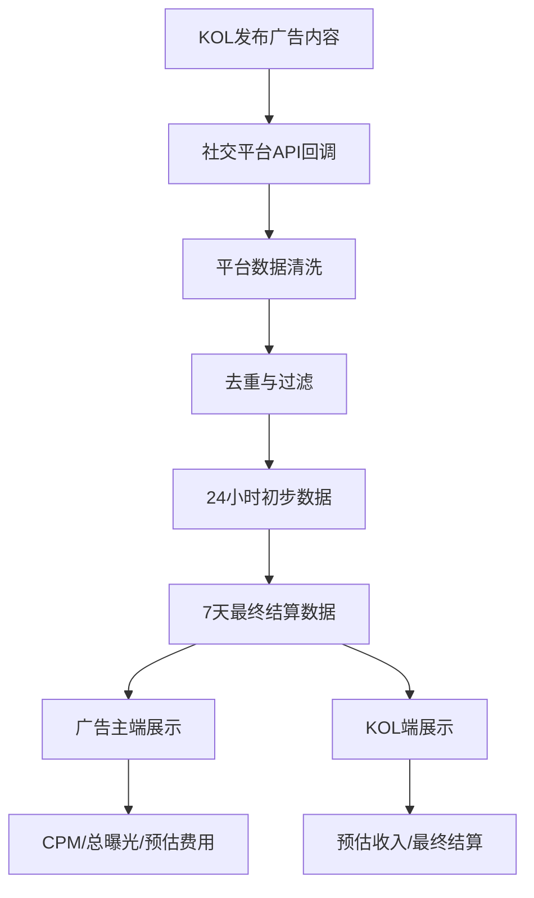

### 1.2 三方数据看板设计

#### 广告主端数据展示

| 字段 | 数据类型 | 更新频率 | 说明 |
|------|---------|---------|------|
| 任务名称 | 文本 | 创建时 | 广告主自定义 |
| 投放KOL | 列表 | 实时 | 头像+昵称+粉丝数 |
| 内容链接 | URL | 发布后 | 跳转原平台查看 |
| 曝光量 | 数字 | 每2小时 | 实时/最终数据 |
| CPM单价 | 货币 | 创建时 | 广告主设定出价 |
| 应付金额 | 货币 | 实时计算 | 曝光量/1000 × CPM |
| 任务状态 | 状态 | 实时 | 进行中/已完成/审核中 |

#### KOL端收入展示

| 字段 | 数据类型 | 更新频率 | 说明 |
|------|---------|---------|------|
| 任务名称 | 文本 | 接单时 | 广告主Brief标题 |
| 广告主 | 文本 | 接单时 | 公司名称（可匿名） |
| 发布时间 | 日期 | 发布后 | 实际发布日期 |
| 曝光量 | 数字 | 每2小时 | 实时数据 |
| 预估收入 | 货币 | 实时计算 | 当前曝光×CPM单价 |
| 结算状态 | 状态 | 结算后 | 待结算/已结算 |
| 实际到账 | 货币 | 结算后 | 扣除平台佣金后 |

### 1.3 数据更新频率与质量保障

| 数据类型 | 更新频率 | 延迟 | 质量保障措施 |
|---------|---------|------|------------|
| 实时曝光 | 每2小时 | <2小时 | API重试机制，数据补全 |
| 每日汇总 | 每天02:00 | 24小时 | 数据校验，异常检测 |
| 最终结算 | 发布后第8天 | 7天 | 归因窗口结束，数据锁定 |
| 异常数据 | 实时监控 | 即时 | 刷量检测，人工复核 |

#### 防作弊机制

```python
class FraudDetection:
    """防作弊检测系统"""
    
    async def detect_fraud(self, impression_data: Dict) -> FraudResult:
        """检测刷量行为"""
        
        # 1. 互动率异常检测
        engagement_rate = impression_data['likes'] / impression_data['views']
        if engagement_rate < 0.001:  # 互动率低于0.1%
            return FraudResult(type="low_engagement", confidence=0.9)
        
        # 2. 观看时长异常
        if impression_data['avg_watch_time'] < 3:  # 平均观看<3秒
            return FraudResult(type="short_watch", confidence=0.8)
        
        # 3. 流量来源异常
        if self._is_suspicious_source(impression_data['source']):
            return FraudResult(type="suspicious_source", confidence=0.7)
        
        # 4. 时间分布异常（非自然增长）
        if not self._has_natural_growth_pattern(impression_data['timeline']):
            return FraudResult(type="unnatural_growth", confidence=0.85)
        
        return FraudResult(type="clean", confidence=1.0)
```

---

## 二、自动化收入结算与分发系统

### 2.1 为什么必须自动化？

| 维度 | 人工操作 | Agent自动化 | 优势对比 |
|------|---------|------------|---------|
| 处理规模 | <100人 | 10,000+人 | 100倍效率提升 |
| 结算周期 | 每月1次，耗时1周 | 实时/每日，分钟级 | 时效性大幅提升 |
| 错误率 | 3-5% | <0.1% | 准确性显著提高 |
| 税务处理 | 人工计算，易出错 | 自动计算+报表生成 | 合规性保障 |
| 货币转换 | 汇率人工查询 | 实时汇率API | 成本优化 |

### 2.2 自动结算系统架构

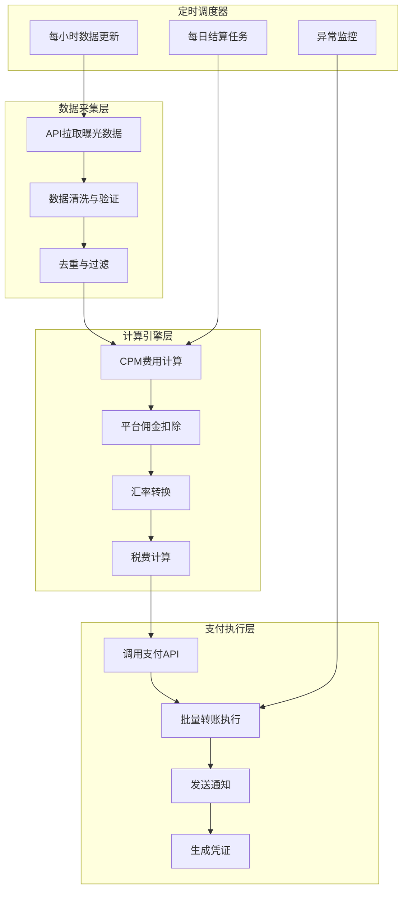

### 2.3 支付渠道选择矩阵

| 渠道 | 适用地区 | 费率 | 结算速度 | 集成难度 | 推荐指数 |
|------|---------|------|---------|---------|---------|
| **Stripe Connect** | 全球40+国家 | 0.5% + $0.25 | T+2 | 中等 | ⭐⭐⭐⭐⭐ |
| **PayPal Payouts** | 全球 | 2% | T+1 | 简单 | ⭐⭐⭐⭐ |
| **TransferWise** | 全球 | 0.5-1% | T+1 | 中等 | ⭐⭐⭐⭐ |
| **本地银行转账** | 单一国家 | 低 | T+3 | 复杂 | ⭐⭐⭐ |
| **支付宝国际版** | 中国/东南亚 | 1% | T+1 | 简单 | ⭐⭐⭐⭐ |

**推荐方案**：**Stripe Connect** + **PayPal Payouts** 双通道，KOL自行选择收款方式。

### 2.4 税务自动处理系统

```python
class TaxCalculationEngine:
    """税务自动计算引擎"""
    
    # 全球税务配置表
    TAX_CONFIG = {
        'US': {'withholding_rate': 0.0, 'requires_form': ['W-8', 'W-9']},
        'UK': {'withholding_rate': 0.0, 'requires_form': []},
        'DE': {'withholding_rate': 0.15, 'requires_form': []},
        'JP': {'withholding_rate': 0.10, 'requires_form': []},
        'SG': {'withholding_rate': 0.0, 'requires_form': []},
        # ... 更多国家配置
    }
    
    async def calculate_settlement(self, kol_id: str, exposure: int, cpm_rate: float) -> SettlementResult:
        """计算最终结算金额"""
        
        # 1. 获取KOL所在国家
        kol_country = await self.db.get_kol_country(kol_id)
        
        # 2. 计算总收入
        gross_amount = (exposure / 1000) * cpm_rate
        
        # 3. 扣除平台佣金（15%）
        PLATFORM_COMMISSION = 0.15
        platform_fee = gross_amount * PLATFORM_COMMISSION
        amount_after_platform = gross_amount - platform_fee
        
        # 4. 根据国家预扣税
        tax_config = self.TAX_CONFIG.get(kol_country, {'withholding_rate': 0.0})
        withholding_tax = amount_after_platform * tax_config['withholding_rate']
        
        # 5. 最终到账金额
        final_amount = amount_after_platform - withholding_tax
        
        # 6. 生成税务报表
        tax_report = await self.generate_tax_report(
            kol_id=kol_id,
            period=datetime.now().strftime("%Y-%m"),
            gross_amount=gross_amount,
            platform_fee=platform_fee,
            withholding_tax=withholding_tax,
            net_amount=final_amount
        )
        
        return SettlementResult(
            gross_amount=gross_amount,
            platform_fee=platform_fee,
            withholding_tax=withholding_tax,
            final_amount=final_amount,
            tax_report_url=tax_report.url
        )
```

---

## 三、KOL智能检索与筛选系统

### 3.1 多维度筛选体系

#### 一级筛选维度

| 维度 | 选项 | 筛选方式 | 说明 |
|------|------|---------|------|
| **平台** | TikTok, YouTube, Instagram, X | 多选 | 支持跨平台投放 |
| **粉丝数** | 1k-5k, 5k-10k, 10k-50k, 50k-100k | 滑块区间 | 精准定位目标量级 |
| **垂直领域** | 美妆, 3C数码, 家居, 健身, 旅行等 | 多选 | 基于内容分类 |
| **地区** | 北美, 欧洲, 东南亚, 拉美, 中东 | 多选+国家搜索 | 支持区域定向 |
| **粉丝属性** | 性别比例, 年龄分布, 兴趣标签 | AI分析筛选 | 基于粉丝画像 |

#### 二级筛选维度

| 维度 | 选项 | 筛选方式 | 说明 |
|------|------|---------|------|
| **历史表现** | 平均互动率, 过往合作品牌 | 排序 | 基于历史数据 |
| **价格区间** | $0-50, $50-100, $100-200, $200+ | 滑块区间 | 预算控制 |
| **内容形式** | 短视频, 图文, 直播, 长视频 | 多选 | 内容类型偏好 |
| **语言能力** | 英语, 西班牙语, 阿拉伯语等 | 多选 | 多语言支持 |
| **档期状态** | 立即可接, 本周, 本月, 需预约 | 单选 | 时间安排 |

### 3.2 检索技术实现

#### 数据库索引设计

```sql
-- KOL画像表核心字段
CREATE TABLE kol_profiles (
    kol_id VARCHAR(36) PRIMARY KEY,
    nickname VARCHAR(100),
    avatar_url VARCHAR(500),
    platform ENUM('tiktok', 'youtube', 'instagram', 'twitter'),
    followers INT,
    engagement_rate DECIMAL(5,4),
    country_code CHAR(2),
    primary_category VARCHAR(50),
    interest_tags JSON,  -- 存储兴趣标签数组
    avg_cpm DECIMAL(10,2),
    last_active DATETIME,
    -- 索引设计
    INDEX idx_platform_followers (platform, followers),
    INDEX idx_country_category (country_code, primary_category),
    INDEX idx_engagement_rate (engagement_rate DESC),
    FULLTEXT INDEX idx_interest_tags (interest_tags)
);
```

#### 智能检索查询

```python
class KOLSearchEngine:
    """KOL智能检索引擎"""
    
    async def search_kols(self, filters: SearchFilters) -> List[KOLResult]:
        """执行多维度KOL检索"""
        
        # 构建Elasticsearch查询
        es_query = {
            "bool": {
                "must": self._build_must_clauses(filters),
                "should": self._build_should_clauses(filters),
                "filter": self._build_filter_clauses(filters),
                "minimum_should_match": 1
            }
        }
        
        # 执行搜索
        results = await self.es.search(
            index="kol_profiles",
            body={
                "query": es_query,
                "sort": self._build_sort_clauses(filters),
                "from": filters.offset,
                "size": filters.limit
            }
        )
        
        # 智能排序（业务规则重排）
        reranked_results = self._business_rerank(results, filters)
        
        return reranked_results
    
    def _business_rerank(self, results: List[KOLResult], filters: SearchFilters) -> List[KOLResult]:
        """业务规则重排算法"""
        
        for kol in results:
            base_score = kol.score
            
            # 1. 历史匹配度加分
            if self._has_similar_experience(kol, filters.product_category):
                kol.score *= 1.3
            
            # 2. 档期紧急加分
            if filters.urgency == "high" and kol.availability == "immediate":
                kol.score *= 1.2
            
            # 3. 价格竞争力加分
            market_avg = self._get_market_avg_cpm(filters.target_markets)
            if kol.cpm_rate < market_avg * 0.8:  # 低于市场价20%
                kol.score *= 1.1
            
            # 4. 新KOL冷启动扶持
            if kol.platform_joined_at > datetime.now() - timedelta(days=30):
                if kol.quality_score > 700:  # 高潜力新KOL
                    kol.score *= 1.15
        
        return sorted(results, key=lambda x: x.score, reverse=True)
```

### 3.3 AI智能匹配引擎

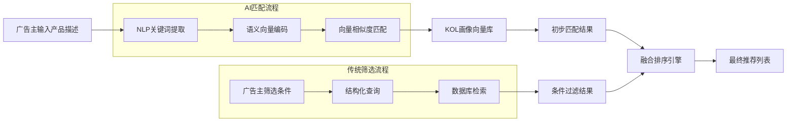

#### AI匹配算法示例

```python
class AIMatchingEngine:
    """AI智能匹配引擎"""
    
    def __init__(self):
        self.sentence_encoder = SentenceTransformer('all-MiniLM-L6-v2')
        self.vector_db = QdrantClient()
    
    async def find_similar_kols(self, product_description: str, limit: int = 20) -> List[KOLMatch]:
        """基于语义相似度匹配KOL"""
        
        # 1. 编码产品描述为向量
        query_embedding = self.sentence_encoder.encode(product_description)
        
        # 2. 在向量数据库中搜索相似KOL
        search_results = self.vector_db.search(
            collection_name="kol_profiles",
            query_vector=query_embedding,
            query_filter=None,  # 可添加过滤条件
            limit=limit * 3  # 获取更多结果用于后续过滤
        )
        
        # 3. 业务规则过滤
        filtered_results = []
        for result in search_results:
            kol = result.payload
            
            # 基础过滤
            if not self._meets_basic_criteria(kol):
                continue
            
            # 计算匹配度得分
            match_score = self._calculate_match_score(result.score, kol, product_description)
            
            filtered_results.append(KOLMatch(
                kol_id=kol['id'],
                match_score=match_score,
                similarity=result.score,
                reasons=self._generate_match_reasons(kol, product_description)
            ))
        
        # 4. 按匹配度排序并返回
        return sorted(filtered_results, key=lambda x: x.match_score, reverse=True)[:limit]
    
    def _calculate_match_score(self, similarity: float, kol: Dict, product_desc: str) -> float:
        """计算综合匹配度得分"""
        
        base_score = similarity * 100  # 将相似度转换为百分制
        
        # 1. 内容相关性权重（40%）
        content_score = self._calculate_content_relevance(kol, product_desc)
        
        # 2. 粉丝重合度权重（30%）
        audience_score = self._calculate_audience_overlap(kol, product_desc)
        
        # 3. 性价比权重（20%）
        value_score = self._calculate_value_score(kol)
        
        # 4. 历史履约分权重（10%）
        performance_score = kol.get('performance_score', 0.5) * 100
        
        # 综合得分
        final_score = (
            content_score * 0.4 +
            audience_score * 0.3 +
            value_score * 0.2 +
            performance_score * 0.1
        )
        
        return final_score

---

## 四、广告内容审核机制

### 4.1 三层审核架构设计

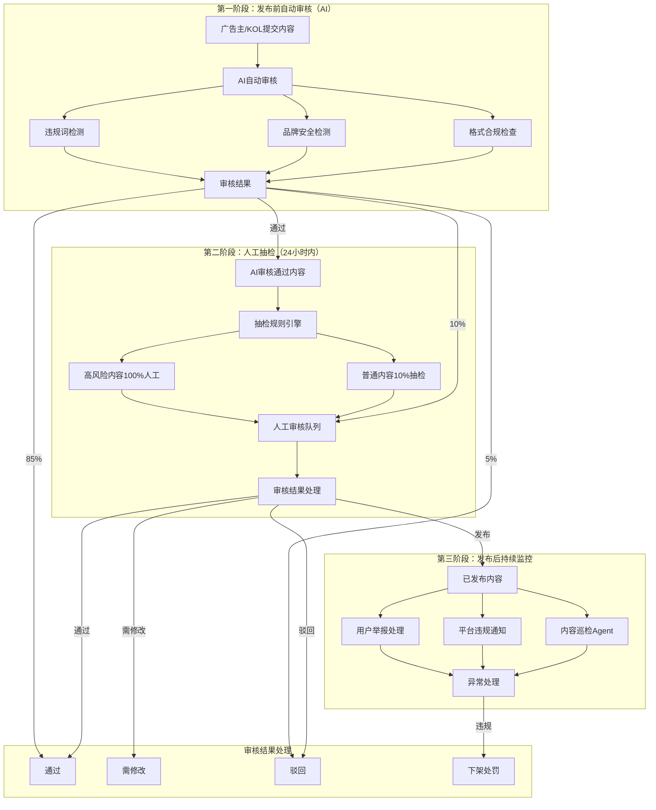

### 4.2 AI审核模型配置

| 检测维度 | 技术方案 | 阈值 | 处理方式 | 优先级 |
|---------|---------|------|---------|-------|
| **违规词检测** | 敏感词库（10万+词）+ 正则匹配 | 命中即驳回 | 自动驳回 | P0 |
| **色情内容** | NSFW图像识别模型 | 置信度>0.7 | 自动驳回 | P0 |
| **暴力内容** | 暴力场景识别模型 | 置信度>0.8 | 自动驳回 | P0 |
| **虚假宣传** | 关键词模式识别 | 命中即标记 | 人工审核 | P1 |
| **品牌安全** | 竞品库匹配 | 命中即标记 | 人工审核 | P1 |
| **版权侵权** | 图像/音频指纹匹配 | 相似度>0.9 | 自动驳回 | P0 |
| **水军检测** | 互动异常分析 | 异常即标记 | 人工审核 | P2 |

### 4.3 审核结果处理流程

```python
class ContentModerationSystem:
    """内容审核系统"""
    
    async def moderate_content(self, content: ContentSubmission) -> ModerationResult:
        """执行内容审核"""
        
        # 并行执行多个审核任务
        tasks = [
            self._check_compliance(content),
            self._check_brand_safety(content),
            self._check_quality(content),
            self._check_copyright(content)
        ]
        
        results = await asyncio.gather(*tasks, return_exceptions=True)
        
        # 综合决策
        decision = self._make_decision(results)
        
        # 生成审核报告
        report = ModerationReport(
            decision=decision,
            reasons=self._collect_reasons(results),
            suggestions=self._generate_suggestions(results),
            confidence=self._calculate_confidence(results)
        )
        
        # 根据决策执行相应操作
        await self._execute_decision(decision, content, report)
        
        return report
    
    def _make_decision(self, results: List[CheckResult]) -> str:
        """基于审核结果做出决策"""
        
        # 1. 任何合规检查失败 → 直接驳回
        for result in results:
            if result.check_type == "compliance" and result.status == "failed":
                return "rejected"
        
        # 2. 高风险内容 → 人工审核
        high_risk_count = sum(1 for r in results if r.risk_level == "high")
        if high_risk_count >= 2:
            return "manual_review"
        
        # 3. 品牌安全问题 → 人工审核
        brand_safety_issues = [r for r in results if r.check_type == "brand_safety" and r.status == "failed"]
        if brand_safety_issues:
            return "manual_review"
        
        # 4. 质量检查失败 → 需修改
        quality_issues = [r for r in results if r.check_type == "quality" and r.status == "failed"]
        if quality_issues:
            return "needs_revision"
        
        # 5. 其他情况 → 通过
        return "approved"
```

### 4.4 审核结果处理矩阵

| 审核结果 | 广告主操作 | KOL操作 | 资金状态 | 后续流程 |
|---------|-----------|---------|---------|---------|
| **通过** | 确认发布 | 按计划发布 | 资金冻结，待结算 | 进入发布队列 |
| **需修改** | 收到修改建议 | 修改后重新提交 | 资金继续冻结 | 重新进入审核队列 |
| **驳回** | 可重新分配KOL | 任务取消，无收益 | 资金解冻，退还 | 可选择其他KOL |
| **发布后被下架** | 收到通知，可申诉 | 收到警告，影响信用分 | 暂停结算，待调查 | 人工介入处理 |

---

## 五、KOL广告频次限制系统

### 5.1 频次规则设计矩阵

| 粉丝量级 | 周频次上限 | 月频次上限 | 单日上限 | 冷却期 | 设计理由 |
|---------|-----------|-----------|---------|-------|---------|
| **1k-5k** | 3条 | 10条 | 1条 | 48小时 | 粉丝基础薄弱，过度商业化易掉粉 |
| **5k-20k** | 4条 | 15条 | 2条 | 36小时 | 有一定粉丝基础，可适度增加 |
| **20k-50k** | 5条 | 20条 | 2条 | 24小时 | 专业创作者，内容质量较高 |
| **50k-100k** | 6条 | 25条 | 3条 | 24小时 | 商业化能力较强，粉丝接受度高 |

#### 附加限制规则

| 限制类型 | 规则 | 技术实现 | 目的 |
|---------|------|---------|------|
| **同一广告主** | 7天内最多1条 | 广告主ID + 时间窗口 | 避免过度曝光 |
| **同品类竞品** | 3天内不能出现竞品广告 | 品类标签 + 时间窗口 | 避免品牌冲突 |
| **平台特有** | TikTok每周≤5条 | 平台特定规则 | 遵守平台算法 |
| **内容类型** | 硬广/软广比例控制 | 内容标签统计 | 维持内容质量 |

### 5.2 频次控制技术实现

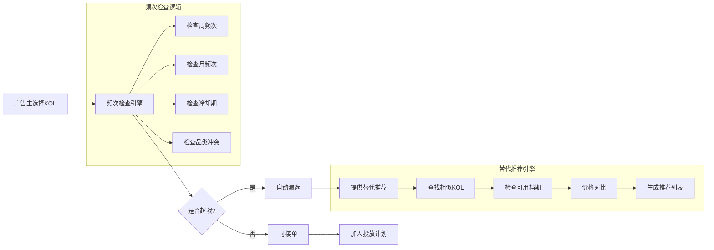

#### 频次检查代码实现

```python
class FrequencyControlEngine:
    """频次控制引擎"""
    
    async def check_frequency_limit(self, kol_id: str, task_details: TaskDetails) -> FrequencyCheckResult:
        """检查KOL是否可接单"""
        
        # 1. 获取KOL基本信息
        kol_info = await self.db.get_kol_info(kol_id)
        
        # 2. 计算各维度频次
        checks = await asyncio.gather(
            self._check_weekly_limit(kol_id),
            self._check_monthly_limit(kol_id),
            self._check_daily_limit(kol_id),
            self._check_cooling_period(kol_id, task_details.category),
            self._check_advertiser_limit(kol_id, task_details.advertiser_id)
        )
        
        weekly_check, monthly_check, daily_check, cooling_check, advertiser_check = checks
        
        # 3. 综合判断
        all_passed = all([
            weekly_check.passed,
            monthly_check.passed,
            daily_check.passed,
            cooling_check.passed,
            advertiser_check.passed
        ])
        
        # 4. 生成结果
        if all_passed:
            return FrequencyCheckResult(
                can_accept=True,
                reason="所有频次检查通过",
                limits_remaining={
                    'weekly': weekly_check.remaining,
                    'monthly': monthly_check.remaining,
                    'daily': daily_check.remaining
                }
            )
        else:
            # 收集失败原因
            failed_checks = []
            if not weekly_check.passed:
                failed_checks.append(f"周频次已达上限（{weekly_check.current}/{weekly_check.limit}）")
            if not monthly_check.passed:
                failed_checks.append(f"月频次已达上限（{monthly_check.current}/{monthly_check.limit}）")
            if not daily_check.passed:
                failed_checks.append(f"日频次已达上限（{daily_check.current}/{daily_check.limit}）")
            if not cooling_check.passed:
                failed_checks.append(f"同品类冷却期中（剩余{cooling_check.remaining_hours}小时）")
            if not advertiser_check.passed:
                failed_checks.append(f"同一广告主限制（{advertiser_check.details}）")
            
            return FrequencyCheckResult(
                can_accept=False,
                reason="；".join(failed_checks),
                next_available=self._calculate_next_available(kol_id, failed_checks)
            )
    
    async def _check_weekly_limit(self, kol_id: str) -> LimitCheckResult:
        """检查周频次限制"""
        
        # 获取本周已接任务数
        week_start = datetime.now().replace(hour=0, minute=0, second=0, microsecond=0)
        week_start = week_start - timedelta(days=week_start.weekday())  # 周一
        
        weekly_count = await self.db.count_tasks(
            kol_id=kol_id,
            status=['accepted', 'in_progress', 'completed'],
            start_date=week_start
        )
        
        # 获取KOL的周频次上限（根据粉丝数）
        kol_info = await self.db.get_kol_info(kol_id)
        weekly_limit = self._get_weekly_limit_by_followers(kol_info.followers)
        
        return LimitCheckResult(
            passed=weekly_count < weekly_limit,
            current=weekly_count,
            limit=weekly_limit,
            remaining=weekly_limit - weekly_count
        )
```

### 5.3 前端自动漏选逻辑

#### 界面交互设计

```javascript
// 前端频次检查逻辑
class KOLSelector {
    constructor() {
        this.selectedKOLs = new Set();
        this.frequencyCache = new Map();
    }
    
    async onKOLSelect(kolId) {
        // 检查频次限制
        const canAccept = await this.checkFrequencyLimit(kolId);
        
        if (!canAccept) {
            // 显示提示并自动移除
            this.showFrequencyWarning(kolId);
            this.selectedKOLs.delete(kolId);
            
            // 提供替代推荐
            const alternatives = await this.getAlternativeKOLs(kolId);
            this.showAlternatives(alternatives);
            
            return false;
        }
        
        this.selectedKOLs.add(kolId);
        return true;
    }
    
    async checkFrequencyLimit(kolId) {
        // 检查缓存
        if (this.frequencyCache.has(kolId)) {
            const cached = this.frequencyCache.get(kolId);
            if (Date.now() - cached.timestamp < 30000) { // 30秒缓存
                return cached.canAccept;
            }
        }
        
        // 调用API检查频次
        const response = await fetch(`/api/kol/${kolId}/frequency-check`);
        const result = await response.json();
        
        // 更新缓存
        this.frequencyCache.set(kolId, {
            canAccept: result.can_accept,
            timestamp: Date.now(),
            reason: result.reason
        });
        
        return result.can_accept;
    }
    
    showFrequencyWarning(kolId) {
        const cacheEntry = this.frequencyCache.get(kolId);
        
        // 显示Toast通知
        toast.warning({
            title: 'KOL不可选',
            message: `该KOL${cacheEntry.reason}，已自动从选择列表中移除。`,
            duration: 5000
        });
        
        // 更新UI
        const kolElement = document.querySelector(`[data-kol-id="${kolId}"]`);
        if (kolElement) {
            kolElement.classList.add('disabled');
            kolElement.querySelector('.status-badge').textContent = '本周已满';
        }
    }
}
```

#### 批量操作处理

```python
class BatchFrequencyChecker:
    """批量频次检查器"""
    
    async def filter_available_kols(self, kol_ids: List[str], advertiser_id: str) -> Dict:
        """批量过滤可接单的KOL"""
        
        # 并行检查所有KOL
        check_tasks = []
        for kol_id in kol_ids:
            task = self._check_single_kol(kol_id, advertiser_id)
            check_tasks.append(task)
        
        results = await asyncio.gather(*check_tasks)
        
        # 分类结果
        available = []
        unavailable = []
        
        for kol_id, result in zip(kol_ids, results):
            if result['can_accept']:
                available.append({
                    'kol_id': kol_id,
                    'limits_remaining': result['limits_remaining']
                })
            else:
                unavailable.append({
                    'kol_id': kol_id,
                    'reason': result['reason'],
                    'next_available': result['next_available']
                })
        
        return {
            'available': available,
            'unavailable': unavailable,
            'summary': {
                'total': len(kol_ids),
                'available_count': len(available),
                'unavailable_count': len(unavailable),
                'availability_rate': len(available) / len(kol_ids) * 100
            }
        }
```

---

## 六、KOL邀请与入驻流程优化

### 6.1 全流程自动化邀请系统

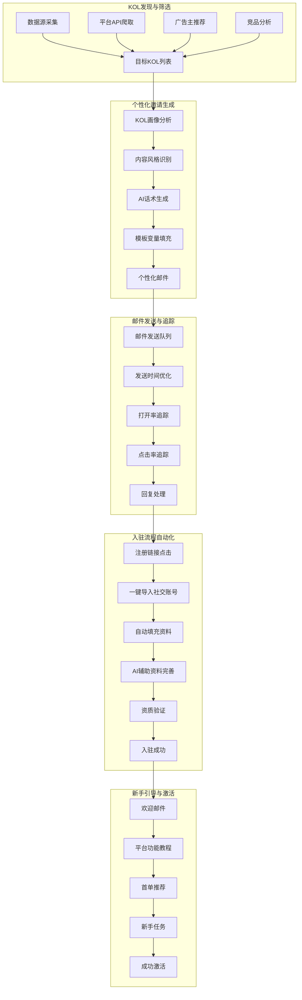

### 6.2 邀请成功率优化策略

| 优化维度 | 具体策略 | 预期提升 | 技术实现 |
|---------|---------|---------|---------|
| **个性化** | AI生成个性化邀请语 | +30% 打开率 | GPT-4 + KOL画像 |
| **时机优化** | 根据时区发送邮件 | +25% 回复率 | 时区分析 + 发送队列 |
| **内容优化** | 展示预估收入 | +40% 点击率 | 收入预测模型 |
| **渠道优化** | 邮件+私信+评论 | +50% 触达率 | 多渠道自动化 |
| **跟进优化** | 智能跟进策略 | +35% 转化率 | 行为触发式跟进 |

#### AI个性化邀请生成

```python
class InvitationGenerator:
    """AI个性化邀请生成器"""
    
    def generate_invitation(self, kol_profile: KOLProfile) -> PersonalizedInvitation:
        """生成个性化邀请"""
        
        # 分析KOL内容风格
        content_style = self._analyze_content_style(kol_profile)
        
        # 分析粉丝互动模式
        engagement_pattern = self._analyze_engagement(kol_profile)
        
        # 生成个性化话术
        personalized_text = self._generate_personalized_text(
            kol_profile=kol_profile,
            content_style=content_style,
            engagement_pattern=engagement_pattern
        )
        
        # 计算预估收入
        estimated_earnings = self._calculate_estimated_earnings(kol_profile)
        
        # 生成注册链接（带追踪参数）
        registration_link = self._generate_tracking_link(kol_profile.id)
        
        return PersonalizedInvitation(
            subject=f"合作邀请：{kol_profile.nickname}，预估月收入${estimated_earnings:,.0f}+",
            body=personalized_text,
            registration_link=registration_link,
            estimated_earnings=estimated_earnings,
            personalization_score=self._calculate_personalization_score(kol_profile)
        )
    
    def _generate_personalized_text(self, **kwargs) -> str:
        """生成个性化邀请文本"""
        
        template = """
尊敬的{kol_name}，

我们关注到您在{platform}平台上的{content_style}内容创作，特别是关于{niche_topics}的内容，获得了{engagement_stats}的粉丝互动。

作为连接全球品牌与优质创作者的平台，我们相信您的创作风格非常适合我们的广告主需求。

**为什么选择我们？**
- **稳定收入**：根据您的粉丝量和互动率，预估月收入可达${estimated_earnings:,.0f}+
- **品牌匹配**：我们已为您匹配{matched_brands_count}个相关品牌
- **操作简单**：一键接单，自动化结算，7天到账
- **内容自由**：您可自主选择合作品牌，保持内容调性

**立即注册，获取专属福利：**
{registration_link}

期待与您合作！

{platform_name}团队
"""
        
        # 填充模板变量
        filled_template = template.format(
            kol_name=kwargs['kol_profile'].nickname,
            platform=kwargs['kol_profile'].platform,
            content_style=self._describe_content_style(kwargs['content_style']),
            niche_topics=self._extract_niche_topics(kwargs['kol_profile']),
            engagement_stats=self._describe_engagement(kwargs['engagement_pattern']),
            estimated_earnings=kwargs['estimated_earnings'],
            matched_brands_count=self._count_matched_brands(kwargs['kol_profile']),
            registration_link=kwargs['registration_link'],
            platform_name="Global KOL Platform"
        )
        
        return filled_template
```

### 6.3 入驻流程优化设计

#### 一键导入功能

| 平台 | 支持功能 | 导入数据 | 技术实现 |
|------|---------|---------|---------|
| **TikTok** | 账号授权 | 粉丝数、互动率、内容标签 | TikTok API OAuth |
| **YouTube** | 频道连接 | 订阅数、观看量、收入历史 | YouTube Data API |
| **Instagram** | 账号绑定 | 粉丝数、帖子数据、互动率 | Instagram Graph API |
| **Twitter/X** | 账号验证 | 粉丝数、推文数据、互动率 | Twitter API v2 |

#### 自动化资料填充

```javascript
// 前端自动化资料填充
class ProfileAutoFill {
    constructor() {
        this.platformApis = {
            'tiktok': new TikTokAPI(),
            'youtube': new YouTubeAPI(),
            'instagram': new InstagramAPI()
        };
    }
    
    async autoFillProfile(platform, authToken) {
        try {
            // 1. 获取平台数据
            const platformData = await this.platformApis[platform].getProfileData(authToken);
            
            // 2. 自动填充表单
            this.fillFormFields(platformData);
            
            // 3. 智能建议补充
            const suggestions = this.generateSuggestions(platformData);
            this.showSuggestions(suggestions);
            
            // 4. 预估收入计算
            const estimatedEarnings = this.calculateEstimatedEarnings(platformData);
            this.updateEarningsDisplay(estimatedEarnings);
            
            return {
                success: true,
                data: platformData,
                suggestions: suggestions,
                estimatedEarnings: estimatedEarnings
            };
            
        } catch (error) {
            console.error('Auto-fill failed:', error);
            return {
                success: false,
                error: error.message
            };
        }
    }
    
    fillFormFields(data) {
        // 自动填充基础信息
        document.getElementById('nickname').value = data.nickname || '';
        document.getElementById('followers').value = data.followers || 0;
        document.getElementById('engagement_rate').value = data.engagement_rate || 0;
        
        // 自动选择品类标签
        if (data.content_categories && data.content_categories.length > 0) {
            this.selectCategories(data.content_categories);
        }
        
        // 自动上传头像
        if (data.avatar_url) {
            this.uploadAvatar(data.avatar_url);
        }
    }
}
```

#### 新手引导流程

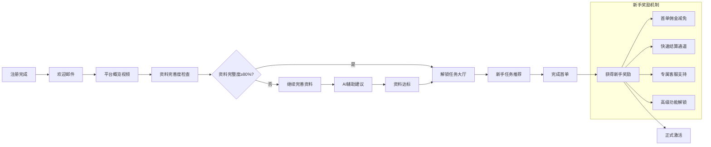

---

## 七、广告主预算控制与分配系统

### 7.1 预算分配策略矩阵

| 预算规模 | 推荐策略 | KOL数量 | 投放周期 | 优化频率 | 预期ROI |
|---------|---------|---------|---------|---------|--------|
| **$500以下** | 集中投放 | 1-3人 | 1-2周 | 每周1次 | 1.5-2.0x |
| **$500-$2,000** | 分层测试 | 5-10人 | 2-4周 | 每周2次 | 2.0-3.0x |
| **$2,000-$10,000** | 组合优化 | 15-30人 | 1-2月 | 每日监控 | 2.5-4.0x |
| **$10,000+** | 全渠道覆盖 | 50-100人 | 季度投放 | 实时优化 | 3.0-5.0x |

#### 智能预算分配算法

```python
class BudgetAllocationEngine:
    """智能预算分配引擎"""
    
    async def allocate_budget(self, total_budget: float, campaign_goals: CampaignGoals) -> BudgetAllocationPlan:
        """智能分配预算"""
        
        # 1. 基于目标分配
        base_allocation = self._allocate_by_goals(total_budget, campaign_goals)
        
        # 2. 基于历史表现优化
        optimized_allocation = await self._optimize_by_history(base_allocation, campaign_goals)
        
        # 3. 基于市场动态调整
        final_allocation = await self._adjust_by_market_dynamics(optimized_allocation)
        
        # 4. 生成分配计划
        allocation_plan = BudgetAllocationPlan(
            total_budget=total_budget,
            allocations=final_allocation,
            expected_roi=self._calculate_expected_roi(final_allocation),
            risk_score=self._calculate_risk_score(final_allocation),
            optimization_suggestions=self._generate_optimization_suggestions(final_allocation)
        )
        
        return allocation_plan
    
    def _allocate_by_goals(self, total_budget: float, goals: CampaignGoals) -> Dict[str, float]:
        """基于营销目标分配预算"""
        
        allocation = {}
        
        # 目标权重分配
        goal_weights = {
            'awareness': 0.4,      # 品牌认知
            'engagement': 0.3,     # 互动参与
            'conversion': 0.2,     # 转化销售
            'retention': 0.1       # 用户留存
        }
        
        # 根据目标优先级调整权重
        for goal in goals.primary_goals:
            if goal in goal_weights:
                goal_weights[goal] *= 1.5  # 主要目标权重提升50%
        
        # 计算各目标预算
        for goal, weight in goal_weights.items():
            allocation[goal] = total_budget * weight
        
        return allocation
    
    async def _optimize_by_history(self, allocation: Dict, goals: CampaignGoals) -> Dict[str, float]:
        """基于历史表现优化分配"""
        
        # 获取历史ROI数据
        historical_roi = await self.db.get_historical_roi(
            advertiser_id=goals.advertiser_id,
            product_category=goals.product_category,
            target_markets=goals.target_markets
        )
        
        # 计算各目标历史表现
        performance_factors = {}
        for goal in allocation.keys():
            historical_data = historical_roi.get(goal, {})
            if historical_data:
                avg_roi = historical_data.get('avg_roi', 1.0)
                success_rate = historical_data.get('success_rate', 0.5)
                performance_factors[goal] = avg_roi * success_rate
            else:
                performance_factors[goal] = 1.0  # 默认值
        
        # 基于表现重新分配
        total_performance = sum(performance_factors.values())
        optimized_allocation = {}
        
        for goal, original_amount in allocation.items():
            performance_factor = performance_factors[goal]
            weight = performance_factor / total_performance
            optimized_allocation[goal] = original_amount * weight * 1.2  # 表现好的增加20%
        
        # 归一化到总预算
        total_optimized = sum(optimized_allocation.values())
        scaling_factor = sum(allocation.values()) / total_optimized
        
        return {goal: amount * scaling_factor for goal, amount in optimized_allocation.items()}
```

### 7.2 实时预算监控与预警

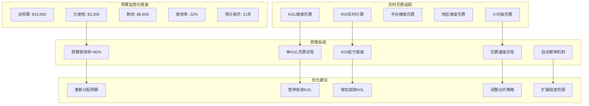

#### 预警规则配置

| 预警类型 | 触发条件 | 预警级别 | 自动操作 | 通知方式 |
|---------|---------|---------|---------|---------|
| **预算使用率** | >80% | 警告 | 无 | 邮件+站内信 |
| **预算使用率** | >95% | 严重 | 暂停新任务 | 邮件+短信+电话 |
| **单KOL花费** | >平均3倍 | 警告 | 标记审查 | 站内信 |
| **ROI异常** | <0.5 | 严重 | 暂停该KOL | 邮件+站内信 |
| **花费速度** | >计划2倍 | 警告 | 调整出价 | 站内信 |
| **零效果KOL** | 花费>0，转化=0 | 警告 | 自动暂停 | 站内信 |

### 7.3 预算调整与优化建议

```python
class BudgetOptimizationAdvisor:
    """预算优化建议引擎"""
    
    async def generate_optimization_suggestions(self, campaign_id: str) -> List[OptimizationSuggestion]:
        """生成预算优化建议"""
        
        # 获取投放数据
        campaign_data = await self.db.get_campaign_data(campaign_id)
        
        suggestions = []
        
        # 1. 基于ROI的优化建议
        roi_suggestions = await self._generate_roi_based_suggestions(campaign_data)
        suggestions.extend(roi_suggestions)
        
        # 2. 基于花费效率的优化建议
        efficiency_suggestions = await self._generate_efficiency_suggestions(campaign_data)
        suggestions.extend(efficiency_suggestions)
        
        # 3. 基于市场趋势的优化建议
        trend_suggestions = await self._generate_trend_based_suggestions(campaign_data)
        suggestions.extend(trend_suggestions)
        
        # 4. 基于预算使用情况的优化建议
        budget_suggestions = self._generate_budget_suggestions(campaign_data)
        suggestions.extend(budget_suggestions)
        
        # 按优先级排序
        suggestions.sort(key=lambda x: x.priority, reverse=True)
        
        return suggestions[:10]  # 返回前10条最高优先级建议
    
    async def _generate_roi_based_suggestions(self, campaign_data: Dict) -> List[OptimizationSuggestion]:
        """基于ROI生成优化建议"""
        
        suggestions = []
        
        # 分析各KOL的ROI表现
        kol_performance = campaign_data.get('kol_performance', [])
        
        # 找出高ROI KOL
        high_roi_kols = [k for k in kol_performance if k['roi'] > 3.0]
        if high_roi_kols:
            suggestions.append(OptimizationSuggestion(
                type="increase_budget",
                title="增加高ROI KOL预算",
                description=f"发现{len(high_roi_kols)}位KOL ROI超过3.0，建议增加其预算分配",
                expected_impact="ROI提升15-25%",
                priority=1,
                action={
                    "type": "reallocate_budget",
                    "from_kols": [k for k in kol_performance if k['roi'] < 1.0],
                    "to_kols": high_roi_kols,
                    "percentage": 30  # 转移30%预算
                }
            ))
        
        # 找出低ROI KOL
        low_roi_kols = [k for k in kol_performance if k['roi'] < 1.0]
        if low_roi_kols:
            suggestions.append(OptimizationSuggestion(
                type="decrease_budget",
                title="减少低ROI KOL预算",
                description=f"发现{len(low_roi_kols)}位KOL ROI低于1.0，建议减少或暂停其预算",
                expected_impact="减少浪费，提升整体ROI",
                priority=2,
                action={
                    "type": "pause_or_reduce",
                    "kols": low_roi_kols,
                    "action": "pause" if len(low_roi_kols) > 3 else "reduce_50_percent"
                }
            ))
        
        return suggestions
```

---

## 八、平台技术架构与扩展性设计

### 8.1 微服务架构设计

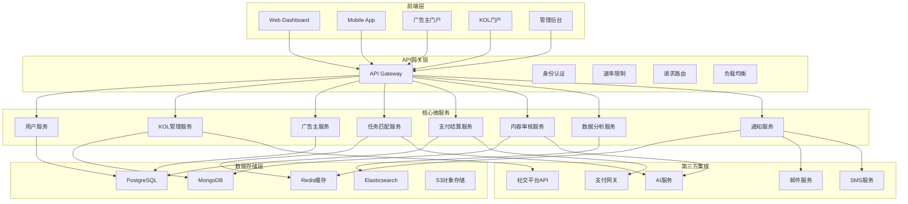

### 8.2 数据库设计要点

#### 核心表结构设计

| 表名 | 主要字段 | 索引设计 | 分区策略 | 预估数据量 |
|------|---------|---------|---------|-----------|
| **users** | id, email, type, status | email(unique), type | 按type分区 | 1000万+ |
| **kol_profiles** | id, platform, followers, engagement | platform, followers_range | 按平台分区 | 500万+ |
| **advertisers** | id, company, budget, industry | company, industry | 按行业分区 | 50万+ |
| **campaigns** | id, advertiser_id, budget, status | advertiser_id, status | 按时间分区 | 500万+ |
| **tasks** | id, campaign_id, kol_id, status | campaign_id, kol_id, status | 复合分区 | 1亿+ |
| **payments** | id, task_id, amount, status | task_id, status, created_at | 按月分区 | 2亿+ |
| **content_submissions** | id, task_id, content_url, status | task_id, status | 按时间分区 | 1亿+ |

#### 分库分表策略

```sql
-- 示例：按时间分区的支付表
CREATE TABLE payments_2025_01 PARTITION OF payments
FOR VALUES FROM ('2025-01-01') TO ('2025-02-01');

-- 示例：按平台分区的KOL表
CREATE TABLE kol_profiles_tiktok PARTITION OF kol_profiles
FOR VALUES IN ('tiktok');

-- 示例：读写分离配置
-- 主库：写操作 + 重要读操作
-- 从库1：报表查询
-- 从库2：用户界面查询
-- 从库3：数据分析查询
```

### 8.3 缓存策略设计

| 缓存类型 | 使用场景 | 缓存时间 | 失效策略 | 技术实现 |
|---------|---------|---------|---------|---------|
| **用户会话** | 登录状态 | 2小时 | 主动失效 | Redis |
| **KOL资料** | 频繁查询 | 1小时 | 定时刷新 | Redis + 本地缓存 |
| **任务列表** | 分页查询 | 5分钟 | 被动失效 | Redis |
| **匹配结果** | AI匹配计算 | 10分钟 | 主动更新 | Redis |
| **配置信息** | 系统配置 | 24小时 | 手动刷新 | 本地缓存 |
| **排行榜** | 热门KOL | 30分钟 | 定时计算 | Redis Sorted Set |

#### 多级缓存实现

```python
class MultiLevelCache:
    """多级缓存系统"""
    
    def __init__(self):
        self.local_cache = {}  # 本地内存缓存
        self.redis_client = redis.Redis(host='redis', port=6379, db=0)
        self.cache_config = {
            'kol_profile': {'local_ttl': 300, 'redis_ttl': 3600},
            'task_list': {'local_ttl': 60, 'redis_ttl': 300},
            'match_result': {'local_ttl': 600, 'redis_ttl': 3600}
        }
    
    async def get_kol_profile(self, kol_id: str) -> Optional[Dict]:
        """获取KOL资料（带多级缓存）"""
        
        # 1. 检查本地缓存
        cache_key = f"kol_profile:{kol_id}"
        if cache_key in self.local_cache:
            cached_data, timestamp = self.local_cache[cache_key]
            if time.time() - timestamp < self.cache_config['kol_profile']['local_ttl']:
                return cached_data
        
        # 2. 检查Redis缓存
        redis_data = await self.redis_client.get(cache_key)
        if redis_data:
            data = json.loads(redis_data)
            # 更新本地缓存
            self.local_cache[cache_key] = (data, time.time())
            return data
        
        # 3. 查询数据库
        db_data = await self.db.get_kol_profile(kol_id)
        if db_data:
            # 写入Redis缓存
            await self.redis_client.setex(
                cache_key,
                self.cache_config['kol_profile']['redis_ttl'],
                json.dumps(db_data)
            )
            # 写入本地缓存
            self.local_cache[cache_key] = (db_data, time.time())
        
        return db_data
```

### 8.4 消息队列与异步处理

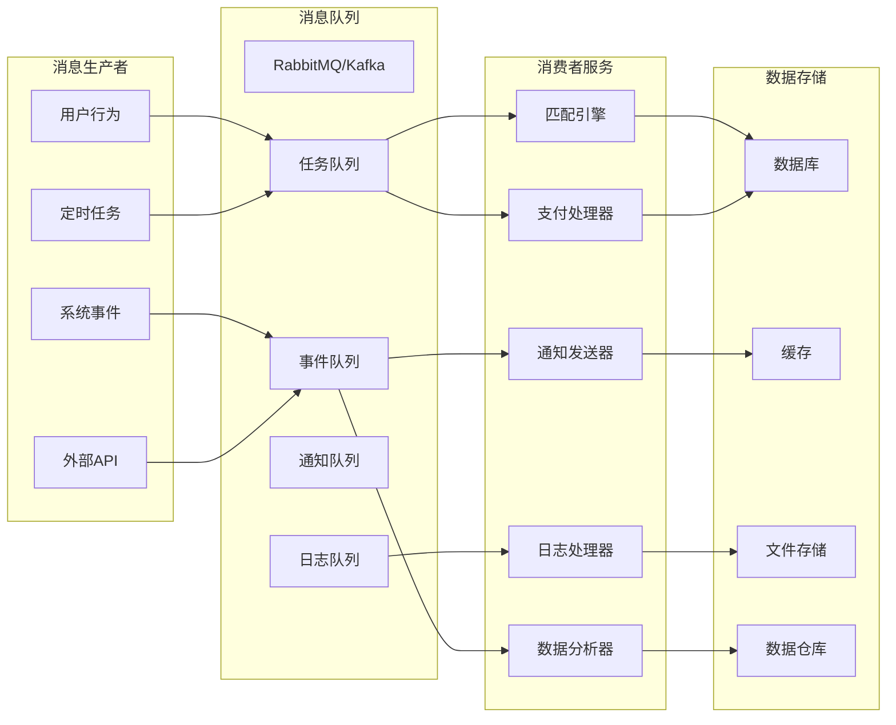

#### 异步任务处理示例

```python
class AsyncTaskProcessor:
    """异步任务处理器"""
    
    async def process_task_creation(self, task_data: Dict) -> TaskCreationResult:
        """异步处理任务创建"""
        
        # 1. 创建基础任务记录
        task_id = await self.db.create_task(task_data)
        
        # 2. 发布到消息队列（非阻塞）
        await self.message_queue.publish('task_created', {
            'task_id': task_id,
            'advertiser_id': task_data['advertiser_id'],
            'budget': task_data['budget'],
            'target_kols': task_data.get('target_kols', [])
        })
        
        # 3. 立即返回响应
        return TaskCreationResult(
            task_id=task_id,
            status='processing',
            estimated_completion_time=datetime.now() + timedelta(minutes=5),
            check_status_url=f'/api/tasks/{task_id}/status'
        )
    
    @consumer(queue='task_created')
    async def handle_task_created(self, message: Dict):
        """处理任务创建后的异步操作"""
        
        try:
            task_id = message['task_id']
            
            # 1. KOL匹配（耗时操作）
            matched_kols = await self.match_engine.find_matching_kols(message)
            
            # 2. 发送通知
            await self.notification_service.send_task_notifications(task_id, matched_kols)
            
            # 3. 更新任务状态
            await self.db.update_task_status(task_id, 'ready_for_kols')
            
            # 4. 记录日志
            await self.log_service.log_task_creation(task_id, len(matched_kols))
            
        except Exception as e:
            # 错误处理：重试或记录错误
            await self.error_handler.handle_async_error('task_creation', message, e)
```

---

## 九、安全与合规设计

### 9.1 数据安全保护策略

| 安全领域 | 保护措施 | 技术实现 | 合规标准 |
|---------|---------|---------|---------|
| **数据传输** | TLS 1.3加密 | HTTPS + HSTS | PCI DSS |
| **数据存储** | AES-256加密 | 数据库加密 + 字段级加密 | GDPR |
| **身份认证** | 多因素认证 | JWT + OAuth 2.0 + MFA | ISO 27001 |
| **访问控制** | RBAC模型 | 基于角色的权限控制 | SOC 2 |
| **审计日志** | 完整操作日志 | 结构化日志 + SIEM集成 | SOX |

#### 敏感数据处理

```python
class SensitiveDataHandler:
    """敏感数据处理类"""
    
    def __init__(self):
        self.encryption_key = self._load_encryption_key()
        self.masking_rules = {
            'email': r'(\w{3})[^@]*@(\w{2})[^.]*\.(.*)',
            'phone': r'(\d{3})\d{4}(\d{4})',
            'id_card': r'(\d{6})\d{8}(\d{4})'
        }
    
    def encrypt_sensitive_data(self, data: Dict) -> Dict:
        """加密敏感数据"""
        
        encrypted_data = {}
        
        for key, value in data.items():
            if key in self.sensitive_fields:
                # 使用AES-256加密
                encrypted_value = self._aes_encrypt(value, self.encryption_key)
                encrypted_data[key] = {
                    'encrypted': True,
                    'value': encrypted_value,
                    'algorithm': 'AES-256-GCM'
                }
            else:
                encrypted_data[key] = value
        
        return encrypted_data
    
    def mask_for_display(self, data: Dict, user_role: str) -> Dict:
        """根据用户角色掩码显示数据"""
        
        masked_data = {}
        
        for key, value in data.items():
            if key in self.sensitive_fields:
                if user_role == 'admin':
                    # 管理员可查看完整数据
                    masked_data[key] = value
                elif user_role == 'support':
                    # 客服只能查看部分掩码数据
                    masked_data[key] = self._partial_mask(value, key)
                else:
                    # 普通用户查看完全掩码数据
                    masked_data[key] = self._full_mask(value, key)
            else:
                masked_data[key] = value
        
        return masked_data
    
    def _partial_mask(self, value: str, field_type: str) -> str:
        """部分掩码"""
        
        if field_type == 'email':
            # example@domain.com → ex***le@do***n.com
            return re.sub(self.masking_rules['email'], r'\1***\2@\3***\4', value)
        elif field_type == 'phone':
            # 13800138000 → 138****8000
            return re.sub(self.masking_rules['phone'], r'\1****\2', value)
        
        return value
```

### 9.2 合规性检查框架

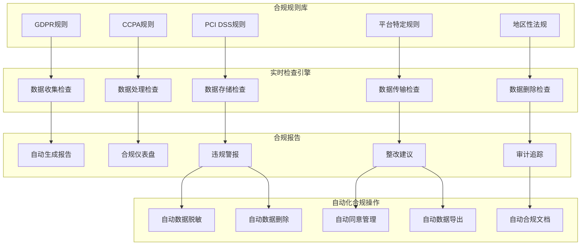

#### GDPR合规实现

```python
class GDPRComplianceManager:
    """GDPR合规管理器"""
    
    async def handle_user_request(self, request_type: str, user_id: str) -> ComplianceResponse:
        """处理用户GDPR请求"""
        
        if request_type == 'data_access':
            return await self._handle_data_access_request(user_id)
        elif request_type == 'data_deletion':
            return await self._handle_data_deletion_request(user_id)
        elif request_type == 'data_portability':
            return await self._handle_data_portability_request(user_id)
        elif request_type == 'consent_update':
            return await self._handle_consent_update_request(user_id)
        else:
            raise ValueError(f"Unknown request type: {request_type}")
    
    async def _handle_data_access_request(self, user_id: str) -> ComplianceResponse:
        """处理数据访问请求"""
        
        # 1. 验证用户身份
        await self._verify_user_identity(user_id)
        
        # 2. 收集用户所有数据
        user_data = await self._collect_all_user_data(user_id)
        
        # 3. 生成可读报告
        report = self._generate_human_readable_report(user_data)
        
        # 4. 记录访问日志
        await self._log_data_access(user_id)
        
        return ComplianceResponse(
            status='completed',
            report=report,
            format='pdf',
            download_url=self._generate_download_url(report),
            expires_in=30  # 30天内有效
        )
    
    async def _handle_data_deletion_request(self, user_id: str) -> ComplianceResponse:
        """处理数据删除请求"""
        
        # 1. 验证用户身份
        await self._verify_user_identity(user_id)
        
        # 2. 开始删除流程
        deletion_id = await self._initiate_deletion_process(user_id)
        
        # 3. 异步执行删除
        asyncio.create_task(self._execute_data_deletion(user_id, deletion_id))
        
        return ComplianceResponse(
            status='processing',
            deletion_id=deletion_id,
            estimated_completion='72小时内',
            check_status_url=f'/api/compliance/deletions/{deletion_id}/status'
        )
    
    async def _execute_data_deletion(self, user_id: str, deletion_id: str):
        """执行数据删除"""
        
        try:
            # 1. 标记数据为待删除
            await self.db.mark_data_for_deletion(user_id, deletion_id)
            
            # 2. 执行实际删除（分批进行）
            deletion_tasks = [
                self._delete_user_profile(user_id),
                self._delete_user_content(user_id),
                self._delete_user_payment_records(user_id),
                self._delete_user_activity_logs(user_id),
                self._delete_user_consent_records(user_id)
            ]
            
            await asyncio.gather(*deletion_tasks)
            
            # 3. 更新删除状态
            await self.db.update_deletion_status(deletion_id, 'completed')
            
            # 4. 发送确认通知
            await self.notification_service.send_deletion_confirmation(user_id)
            
            # 5. 记录审计日志
            await self.audit_log.log_deletion_completion(user_id, deletion_id)
            
            logger.info(f"Data deletion completed for user {user_id}")
            
        except Exception as e:
            logger.error(f"Data deletion failed for user {user_id}: {e}")
            await self.db.update_deletion_status(deletion_id, 'failed', str(e))
```

---

## 十、实施路线图与里程碑

### 10.1 分阶段实施计划

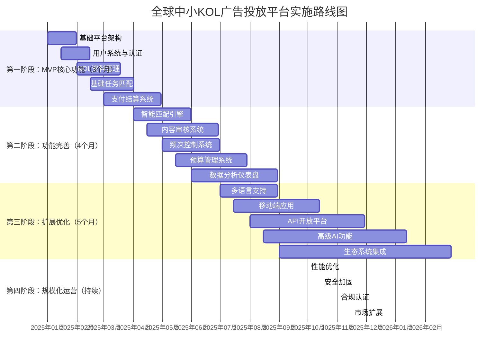

### 10.2 关键里程碑定义

| 里程碑 | 时间点 | 交付物 | 成功指标 | 验收标准 |
|--------|--------|--------|---------|---------|
| **MVP上线** | 第3个月末 | 基础平台可用 | 注册用户>1000 | 核心流程跑通 |
| **首笔交易** | 第4个月 | 完成首单投放 | 交易额>$1000 | 支付结算正常 |
| **智能匹配** | 第6个月 | AI匹配引擎 | 匹配准确率>80% | 用户满意度>4.5 |
| **内容审核** | 第7个月 | 自动化审核 | 审核效率提升50% | 违规率<1% |
| **移动端上线** | 第9个月 | iOS/Android App | 移动端占比>40% | 应用评分>4.5 |
| **API开放** | 第12个月 | 开发者平台 | API调用>100万/月 | 合作伙伴>50 |
| **规模化运营** | 第18个月 | 全功能平台 | 月交易额>$100万 | 盈利模式验证 |

### 10.3 资源需求估算

| 资源类型 | 第一阶段 | 第二阶段 | 第三阶段 | 第四阶段 |
|---------|---------|---------|---------|---------|
| **技术团队** | 5人 | 8人 | 12人 | 15人 |
| **产品团队** | 2人 | 3人 | 4人 | 5人 |
| **运营团队** | 3人 | 5人 | 8人 | 12人 |
| **市场团队** | 2人 | 3人 | 5人 | 8人 |
| **服务器成本** | $2,000/月 | $5,000/月 | $10,000/月 | $20,000/月 |
| **第三方服务** | $1,000/月 | $3,000/月 | $5,000/月 | $8,000/月 |
| **营销预算** | $10,000/月 | $20,000/月 | $30,000/月 | $50,000/月 |

---

## 附录

### A. 技术栈推荐

#### 后端技术栈
- **编程语言**: Python 3.11+ (FastAPI/ Django)
- **数据库**: PostgreSQL 15+ (主数据), MongoDB 6.0+ (文档存储)
- **缓存**: Redis 7.0+ (缓存/消息队列)
- **搜索**: Elasticsearch 8.0+ (全文搜索)
- **消息队列**: RabbitMQ 3.12+ / Apache Kafka
- **容器化**: Docker + Kubernetes
- **监控**: Prometheus + Grafana + ELK Stack

#### 前端技术栈
- **Web框架**: React 18+ / Vue 3+
- **移动端**: React Native / Flutter
- **状态管理**: Redux Toolkit / Pinia
- **UI组件库**: Ant Design / Element Plus
- **构建工具**: Vite / Webpack 5
- **测试**: Jest + React Testing Library

#### 基础设施
- **云服务**: AWS / Google Cloud / Azure
- **CI/CD**: GitHub Actions / GitLab CI
- **容器注册**: Docker Hub / AWS ECR
- **监控**: Datadog / New Relic
- **日志管理**: Logz.io / Splunk

### B. 性能指标要求

| 指标 | 目标值 | 监控频率 | 报警阈值 |
|------|--------|---------|---------|
| **API响应时间** | <200ms (p95) | 实时 | >500ms |
| **页面加载时间** | <2秒 | 实时 | >5秒 |
| **系统可用性** | 99.9% | 每分钟 | <99.5% |
| **数据库连接池** | 使用率<80% | 每分钟 | >90% |
| **缓存命中率** | >90% | 每分钟 | <80% |
| **错误率** | <0.1% | 每分钟 | >1% |
| **并发用户数** | 支持10万+ | 实时 | 容量预警 |

### C. 风险管理矩阵

| 风险类型 | 可能性 | 影响程度 | 缓解措施 | 应急预案 |
|---------|--------|---------|---------|---------|
| **技术风险** | 中 | 高 | 多区域部署，自动故障转移 | 快速回滚，备用环境 |
| **安全风险** | 低 | 极高 | 定期安全审计，渗透测试 | 立即隔离，数据备份恢复 |
| **合规风险** | 中 | 高 | 法律顾问咨询，合规自动化 | 暂停相关功能，法律应对 |
| **市场风险** | 高 | 中 | 多元化市场策略，快速迭代 | 调整定价，优化产品 |
| **运营风险** | 中 | 中 | 标准化流程，自动化监控 | 人工介入，流程优化 |
| **财务风险** | 低 | 高 | 现金流管理，风险准备金 | 成本削减，融资预案 |

### D. 成功案例参考

#### 案例1：美妆品牌投放优化
- **品牌**: 国际美妆品牌A
- **预算**: $50,000
- **KOL数量**: 35人
- **投放周期**: 2个月
- **成果**: ROI 4.2x，品牌搜索量提升180%

#### 案例2：科技产品新品发布
- **产品**: 智能穿戴设备B
- **预算**: $30,000
- **KOL数量**: 25人
- **投放周期**: 1个月
- **成果**: 预售订单1200+，社交媒体曝光500万+

#### 案例3：本地服务推广
- **服务**: 餐饮连锁C
- **预算**: $10,000
- **KOL数量**: 15人
- **投放周期**: 3周
- **成果**: 门店客流量提升65%，线上订单增长120%

---

## 总结

本方案详细设计了全球中小KOL广告投放平台的核心功能架构，涵盖从KOL发现、智能匹配、内容审核、频次控制、预算管理到技术实现的全流程。通过AI驱动的智能匹配引擎、自动化审核系统、精细化预算控制等创新功能，平台能够为广告主提供高效、透明、可量化的KOL营销解决方案，同时为中小KOL创作者提供稳定的收入来源和成长机会。

**核心价值主张**：
1. **对广告主**: 降低KOL营销门槛，提升投放效果和ROI
2. **对KOL**: 提供稳定收入，简化接单流程，数据透明
3. **对平台**: 构建全球化创作者经济生态，实现多方共赢

**技术实现要点**：
- 微服务架构确保系统可扩展性和可靠性
- AI算法提升匹配准确性和运营效率
- 自动化流程减少人工干预，降低运营成本
- 严格的安全合规设计保障用户数据安全

**未来扩展方向**：
1. 扩展到更多社交媒体平台和地区市场
2. 引入更多AI功能（内容生成、效果预测等）
3. 构建KOL培训和发展生态系统
4. 开发品牌-KOL长期合作模式
5. 探索区块链技术在版权和结算中的应用

通过分阶段实施和持续优化，本平台有望成为全球中小KOL营销领域的领先解决方案，推动创作者经济的健康发展。